## At a Glance

| | |
|---|---|
| **What it is** | Multi-tenant wholesale ERP and commerce platform |
| **Who it's for** | Import/wholesale businesses with parent companies and sister concerns |
| **Core problem** | Run procurement, stock, sales, storefronts, dropship, and treasury in one system — without data leaking between tenants |
| **How it's built** | Vue 3 / Quasar SPA → Supabase PostgreSQL with RLS + atomic RPCs |
| **Scale** | 17+ domain modules · 980+ migrations · 470+ Vue components · 4 application scopes |

---

## The Problem

Wholesale import businesses in Bangladesh and similar markets run complex operations across multiple legal entities:

- A **parent company** handles international procurement, customs clearance, and warehouse stock
- **Sister concerns (child tenants)** run wholesale desks, B2B storefronts, and dropship reseller networks
- **External investors** fund shipment batches and need yield visibility
- **B2B customers** order through branded storefronts with their own wallets and credit limits

### Pain points before TradeflowBD

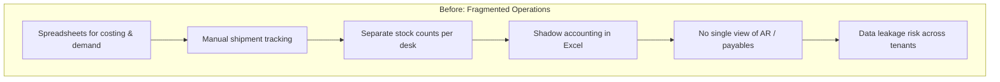

| Pain Point | Business Impact |
|---|---|
| **No shared stock pool** | Same physical inventory counted separately per sister concern — overselling and reconciliation nightmares |
| **Fragmented finance** | Margins calculated in spreadsheets; no single ledger for vendors, couriers, customers, and investors |
| **Tenant data leakage risk** | Application-level filtering is not enough when competing businesses share one database |
| **Rigid feature tiers** | Enabling dropship or investor capital for one tenant required code changes, not configuration |
| **Slow onboarding** | New sister concern = days of manual setup, stock duplication, and permission wiring |
| **No customer-facing commerce** | Wholesale desks had no B2B storefront; orders came through phone and WhatsApp |

### The core question

> How do you build one SaaS platform where a parent company pools physical stock, multiple child desks sell from allocations, customers shop online, investors see yield — and **no tenant can ever see another tenant's data**?

---

## The Solution

TradeflowBD is a **plug-and-play multi-tenant ERP** that covers the full wholesale lifecycle:

```text
Pre-Order Costing → Inbound Shipment & Landed Cost → Warehouse Pooling
    → Multi-Desk Selling (Wholesale / Storefront / Dropship)
        → Universal Wallet Settlement → Treasury & Investor Reporting
```


One platform. Four login surfaces. Database-enforced isolation. Configuration-driven modules.

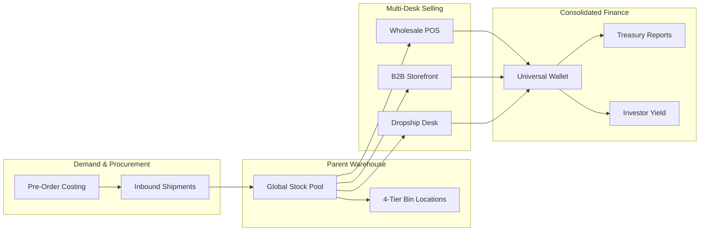

---

## Architecture

### High-level system design

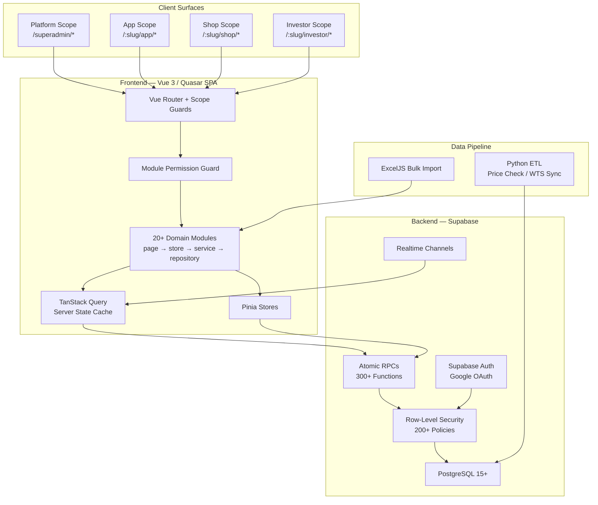

### Deployment topology

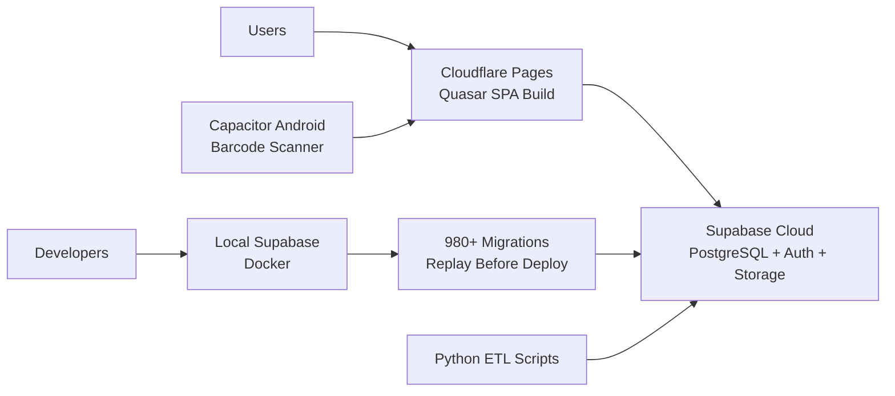

---

## Multi-Tenant Model

The hardest design problem was **parent–child hierarchy with shared stock but isolated desks**.

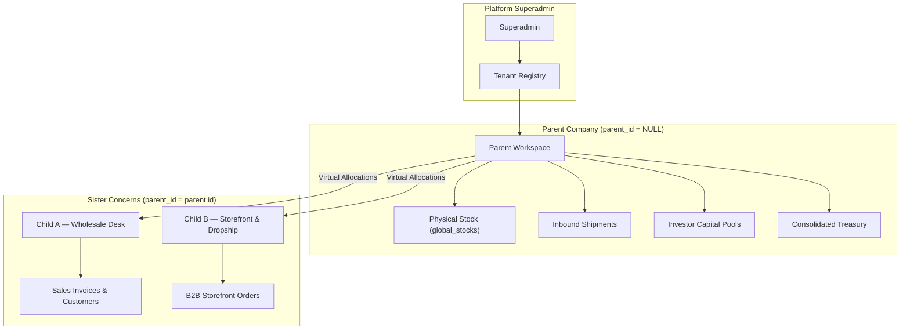

### Ownership rules

| Entity | Owner | Child Access |
|---|---|---|
| Physical stock (`global_stocks`) | Parent only | Read via `global_stock_allocations` |
| Inbound shipments | Parent only | None |
| Sales invoices | Parent books, child branding | Child creates via `issued_by_tenant_id` |
| Shop orders | Child tenant | Parent sees consolidated wallet |
| Wallet ledger | Parent books (`parent_tenant_id`) | Child tagged via `operating_tenant_id` |

**Key rule:** Hierarchy is strictly **one level deep**. A child cannot have children. A parent with children cannot be assigned a parent.

---

## Four Application Scopes

One codebase, four distinct user experiences — each with its own auth flow, layout theme, and permission model.

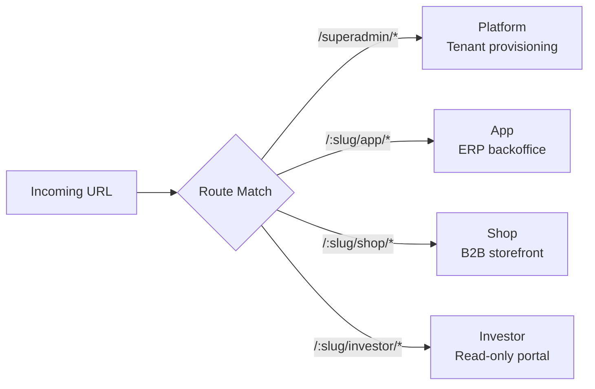

| Scope | Users | Primary Capabilities |
|---|---|---|
| **Platform** | Superadmin | Create tenants, global reference data, platform health |
| **App** | Admin & Staff | Procurement, stock, invoices, wallet, settings, dropship desk |
| **Shop** | B2B Customers | Catalog browse, cart checkout, order tracking, merchant wallet |
| **Investor** | Capital Partners | Shipment batch profitability, capital statements, yield performance |

---

## Permission & Module Gating

Features are not hardcoded per tenant. A three-layer guard decides access at runtime.

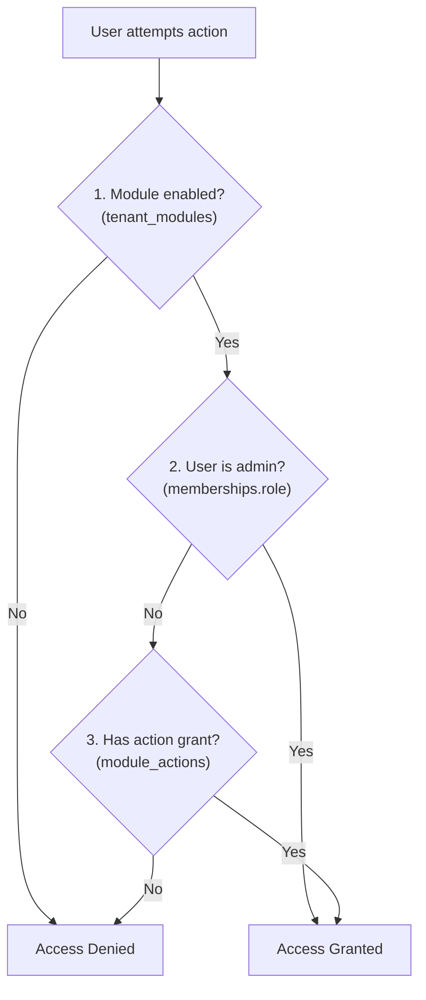

### Action grant hierarchy

```text
view    → Read tables and detail pages
create  → Add new records
edit    → Modify drafts and configs
delete  → Soft-delete to Trash
manage  → Admin overrides, voiding, settings
order   → Customer cart placement (shop scope only)
```

Navigation menus and dashboard widgets are filtered dynamically — a tenant without the `thrift` module never sees thrift routes, even if the code exists in the bundle.

---

## Core Technical Decisions

### Decision 1 — Database-level isolation, not app-level filtering

| | |
|---|---|
| **Problem** | Competing corporate tenants share one PostgreSQL database. A bug in a `WHERE tenant_id = ?` clause leaks financial data. |
| **Decision** | Row-Level Security (RLS) on every tenant-scoped table, evaluated from the authenticated session token — not from client-side filters. |
| **Outcome** | Queries cannot cross tenant boundaries even under concurrent high-throughput access. Security boundary is the database, not the Vue app. |

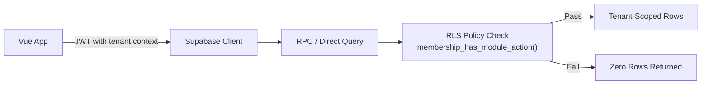

---

### Decision 2 — Parent-owned stock, virtual child allocations

| | |
|---|---|
| **Problem** | Sister concerns selling the same physical inventory each maintain separate stock counts — leading to overselling and reconciliation failures. |
| **Decision** | Physical stock rows exist only on the parent tenant. Children receive virtual allocation slices (`global_stock_allocations`) for their sales desks. |
| **Outcome** | Single source of truth for ATP (available-to-promise). Wholesale POS, storefront, and dropship all draw from the same pool without duplication. |

---

### Decision 3 — Atomic RPCs for all complex writes

| | |
|---|---|
| **Problem** | Invoice issuance touches stock allocation, movement logs, wallet ledger, and billing profile balance — a partial client-side write corrupts data. |
| **Decision** | All multi-table mutations run as `SECURITY DEFINER` PostgreSQL RPCs (`create_invoice_from_payload`, `confirm_dropship_delivered`, `finalize_shipment`, etc.). |
| **Outcome** | Every business transaction is atomic. TypeScript types are regenerated from the schema after each migration (`backend:types`). |

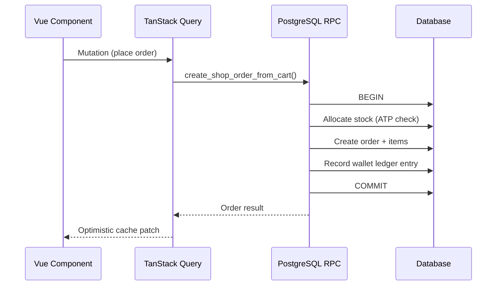

---

### Decision 4 — Universal Wallet with no shadow ledgers

| | |
|---|---|
| **Problem** | Separate accounting tables per entity type (customer AR, vendor AP, courier COD, investor capital) create fragmented, unreconcilable finance. |
| **Decision** | One wallet per `(parent_tenant_id, entity_type, entity_id, currency)`. P&L derived from immutable cost snapshots (`landed_cost_bdt`) — not duplicate ledger balances. |
| **Outcome** | Consolidated treasury on parent books. Child desks tagged via `operating_tenant_id` for audit drill-down. No shadow accounting. |

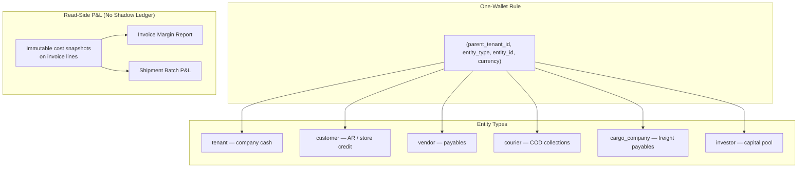

---

### Decision 5 — TanStack Query for server state orchestration

| | |
|---|---|
| **Problem** | Pinia stores refetching on every navigation caused redundant RPC calls and stale UI on complex pages (shop pricing, shipment costing). |
| **Decision** | TanStack Query (`@tanstack/vue-query`) with query key factories, `staleTime` tuning, optimistic mutations, and targeted cache patches. |
| **Outcome** | Add-to-cart patches the cart cache without refetching the full active-carts list. Shipment costing uses batch RPCs, never per-item loops. |

---

### Decision 6 — Domain-modular schema split

| | |
|---|---|
| **Problem** | A single 10,000+ line `public.sql` made every schema change high-risk and slow to review. |
| **Decision** | Split into domain folders (`procurement/`, `shop_order/`, `sales_invoice/`) each with `02_tables.sql`, `03_rpcs.sql`, `04_rls.sql`. |
| **Outcome** | Procurement and commerce schema can evolve independently. Local Docker replay validates migrations before production deploy. |

---

## Domain Modules

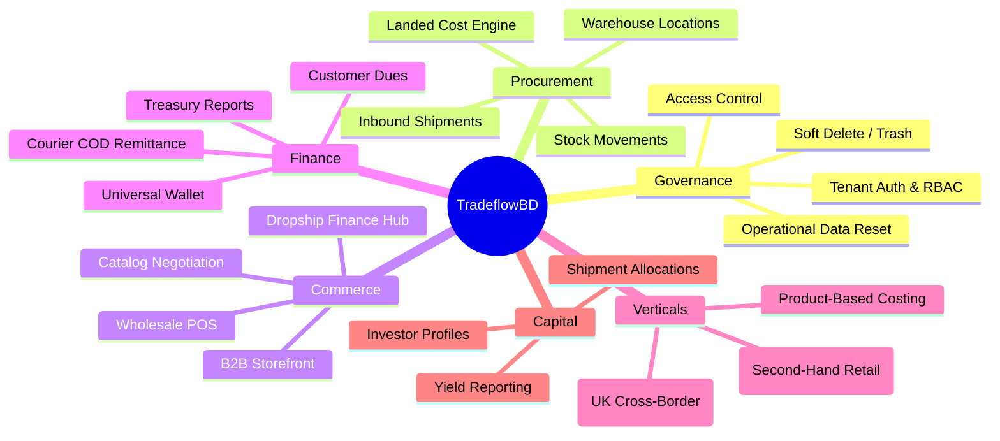

### Module highlights

| Module | What it solves |
|---|---|
| **Procurement & Stock** | International shipment intake, freight/customs cost entries, landed cost apportionment by weight, 4-tier bin hierarchy |
| **Sales Invoice** | Wholesale POS with FIFO stock search, billing profiles, returns restocking, invoice paper printing |
| **Shop & Dropship** | Three shop types (catalog, in-stock, dropship), B2B cart/checkout, 3-step Dropship Finance Hub settlement |
| **Product-Based Costing** | Pre-order demand files with customer backlog auto-suggest → procurement demand list handoff |
| **Universal Wallet** | Multi-currency double-entry ledger for all entity types, cash-in reports, atomic transfers |
| **Reporting & Treasury** | Invoice margin, shipment P&L, customer dues aging, courier bulk remittance |
| **Investor Capital** | Shipment batch cost-share allocations, read-side yield, capital ledger |
| **Thrift** | Second-hand vertical: consignment shipments, thermal barcodes, garment measurements, POS, COD remittance |
| **Koba** | UK catalog scraping pipeline (Python), commission pricing, cross-border order fulfillment |


---

## Dropship Finance Hub — Example End-to-End Flow

Shows how procurement, commerce, and wallet layers connect in one atomic workflow.

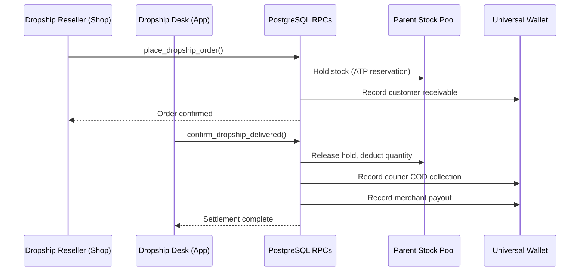

---

## Landed Cost Engine

Every margin report, invoice line, and investor yield calculation depends on accurate unit costs stamped at shipment finalization.


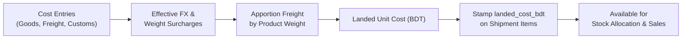

**Formula:**

```text
Landed Cost (BDT) = (Purchase Price × FX Rate) + Apportioned Cargo Charge + Customs Surcharge
```

Dual-phase design: in-memory preview in the UI; authoritative stamp written to the database only on shipment finalization.

---

## Tech Stack

| Layer | Technology | Role |
|---|---|---|
| **Frontend** | Vue 3.5 + Quasar 2 + TypeScript | SPA with modular domain architecture |
| **State** | Pinia + TanStack Query | Client state + server cache orchestration |
| **Routing** | Vue Router 5 | Scope-aware guards (platform / app / shop / investor) |
| **Backend** | Supabase (PostgreSQL 15+) | Database, auth, storage, realtime |
| **Security** | RLS + Security-Definer RPCs | Tenant isolation + atomic transactions |
| **Types** | Generated `database.types.ts` | Schema → TypeScript contract on every migration |
| **Deploy** | Cloudflare Pages | Frontend CDN with `dist/spa` output |
| **Local Dev** | Supabase CLI + Docker | Migration replay before production push |
| **ETL** | Python scripts | Price Check / WTS product sync to Supabase |
| **Mobile** | Capacitor (Android) | Barcode scanning and inventory audit companion |
| **Media** | Cloudinary | Image upload and optimization |

---

## Impact & Results

| Metric | Value | Detail |
|---|---|---|
| **Tenant data isolation** | 100% | RLS enforced at database level, not application level |
| **Application scopes** | 4 | Platform, App, Shop, Investor — one codebase |
| **Domain modules** | 17+ | Documented, module-gated, independently evolvable |
| **Database migrations** | 980+ | Versioned schema with local Docker replay |
| **Vue components** | 470+ | Modular page → store → service → repository pattern |
| **Atomic RPCs** | 300+ | All complex writes server-side, type-safe |
| **Onboarding time** | Minutes | Child tenant + module enablement via configuration, not code deploy |
| **Stock duplication** | Eliminated | Parent pool + virtual allocations — single ATP source |

---

## Security & Reliability

- **PostgreSQL RLS** on all tenant-scoped tables with membership-based policy evaluation
- **Atomic RPCs** for invoice creation, dropship settlement, shipment finalization, wallet transfers
- **Four scoped login surfaces** with Google OAuth via Supabase Auth and automatic token refresh
- **Type-safe contracts** between generated Supabase types and frontend stores/composables
- **Archive-first governance** for shipments — financial audit trails preserved, no accidental hard deletes
- **Soft-delete trash** with 30-day retention and tenant-scoped purge engine
- **Local-first development** — Docker Supabase with full migration replay before any production deploy

---

## What I Built (Personal Contributions)

As Lead Framework & Migration Engineer:

- Designed the **parent–child tenant hierarchy** and stock allocation model
- Architected the **Universal Wallet** parent-books consolidation (in progress migration)
- Built the **module permission guard** system (`tenant_modules` + `module_actions` + scope routing)
- Led the **schema modularization** — splitting monolithic SQL into domain-scoped folders
- Established the **page → store → service → repository** module pattern across 20+ domains
- Implemented **TanStack Query** caching strategy with optimistic mutations and batch RPC patterns
- Drove **980+ migrations** with local-first Supabase workflow and generated TypeScript types
- Built specialized verticals: **Thrift** (second-hand retail), **Koba** (UK cross-border), **Dropship Finance Hub**

---

## Visual Workflows & Architecture Wireframes

### 1. Enterprise Desktop Layout — 3-Tier Navigation & Workspace Grid

```
+----------------------------------------------------------------------------------------------------+
|  [Logo] TradeflowBD  |  [Scope: Parent Corp v]  |  [Global Search Ctrl+K]  |  [FX: ৳170]  | (Avatar) |
+----------------------+-----------------------------------------------------------------------------+
| NAVIGATION           | BREADCRUMB: Wholesale > Procurement > Inbound Shipments > Batch #SH-2026-08 |
|                      +-----------------------------------------------------------------------------+
| [=] Dashboard        | +-- BATCH KPI HEADER -----------------------------------------------------+ |
| [T] Tenants & Desks  | | Port of Origin: Felixstowe, UK   | Containers: 4x 40ft HQ   | Status: IN_TRANSIT| |
| [!] Access Control   | | Total CBM: 142.5 m³             | Net Weight: 18,420 kg    | Landed: ৳8.45M    | |
| [?] Help Center      | +-------------------------------------------------------------------------+ |
| [@] Customers        |                                                                             |
| [#] Invoices (POS)   | +-- ACTION TOOLBAR -------------------------------------------------------+ |
| [>] Procurement      | | [+ Add Items] [Apportion Landed Costs] [Print Thermal Tags] [v Export]   | |
| [*] Product Costing  | +-------------------------------------------------------------------------+ |
| [$] Shop & Dropship  |                                                                             |
| [&] Wallets & Ledger | +-- REAL-TIME PRODUCT APPORTIONMENT TABLE --------------------------------+ |
|                      | | [x] | SKU Code     | Product Name         | Qty  | Unit(£) | Landed(৳) | Margin% | |
|                      | |-----|--------------|----------------------|------|---------|-----------|---------| |
|                      | | [ ] | TOALP001     | Alpecin Shampoo C1   | 1200 | £4.75   | ৳1,280.00 | 18.5%   | |
|                      | | [ ] | TOAQU133A    | Aquafresh Toothpaste | 3500 | £0.75   | ৳380.00   | 14.2%   | |
|                      | | [ ] | TONXT-JKT    | Next Corduroy Jacket | 450  | £12.00  | ৳2,850.00 | 32.0%   | |
|                      | +-------------------------------------------------------------------------+ |
| [<-] Sign Out        | PAGE 1 OF 18 (240 ITEMS)                      [<<] [<] [1] [2] [3] [>] [>>] |
+----------------------+-----------------------------------------------------------------------------+
```

### 2. Multi-Tenant Stock Allocation & Landed Cost Engine Workflow

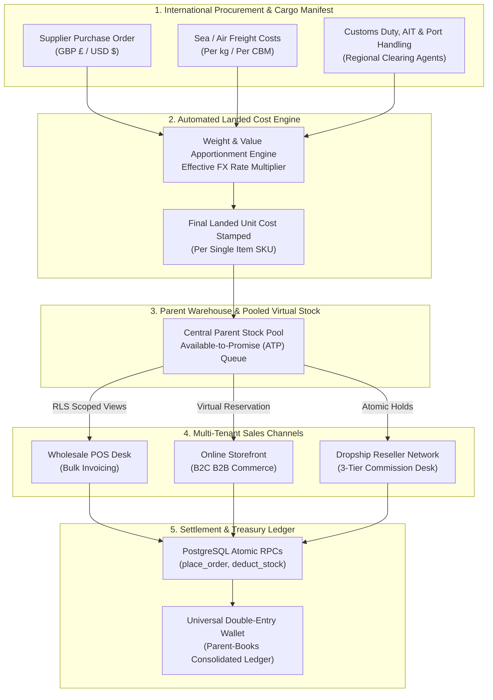

---

## Future Roadmap

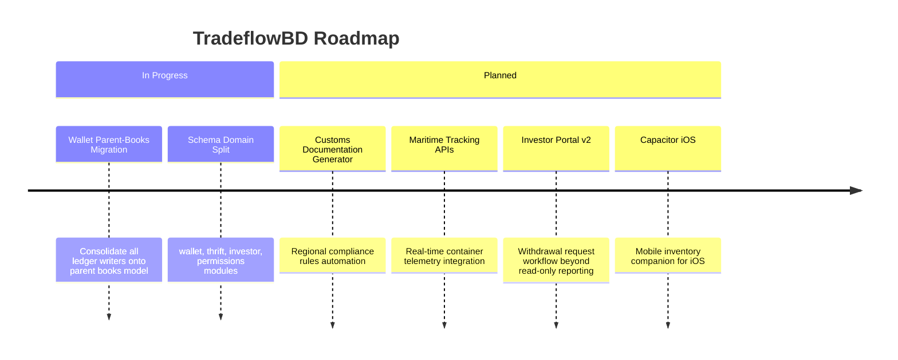
