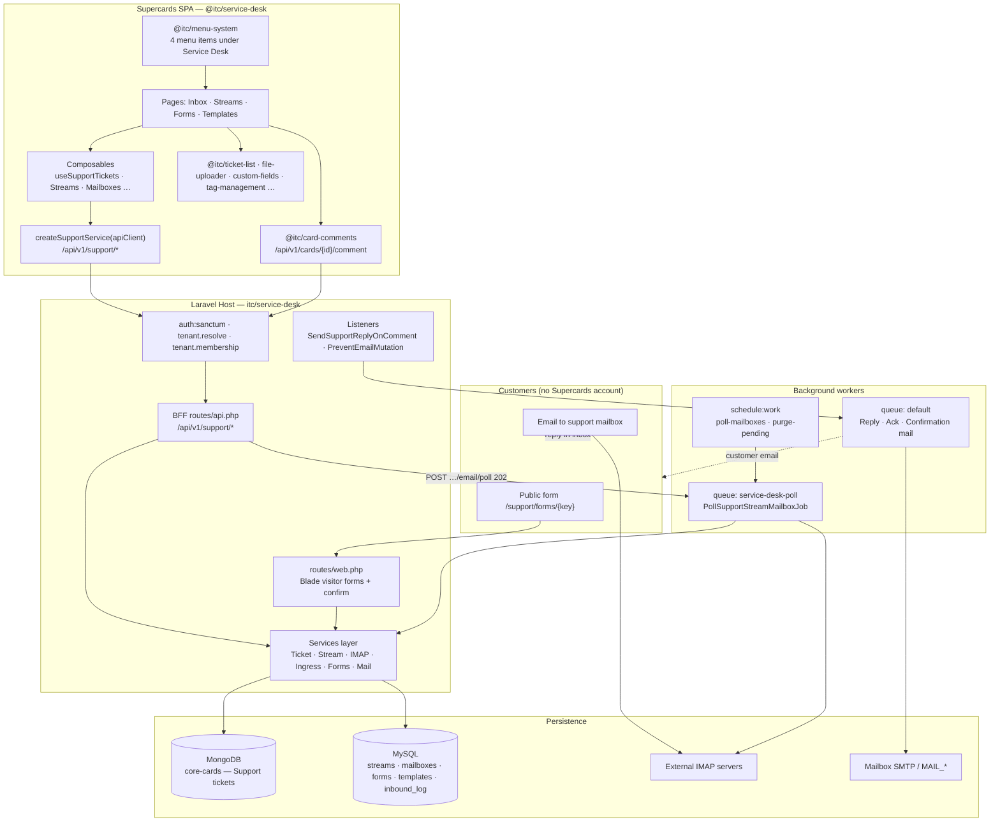

## Executive Summary

**Service Desk** is a multi-channel customer-support module inside **Supercards**. I built it **full stack**: the **frontend** `@itc/service-desk` Quasar library (agent UI) and the **backend** `itc/service-desk` Laravel BFF (API, workers, visitor pages).

**Agents** use a desktop SPA workbench at `/service-desk`—Gmail-style inbox with split-pane detail, filters (stream, tags, scope, search), assignees/watchers, attachments, and threaded comments with **Reply to customer** vs **Internal note** for email and form channels. **Admins** configure **streams** (queues with members, watchers, ticket categories), **IMAP mailboxes** (Gmail/Outlook presets, test connection, manual “Check for new mail”), **public web forms** (Google Forms–style field builder, themes, routing, reCAPTCHA), and **email templates** (confirmation, acknowledgement).

**Customers never log into Supercards.** They reach support via **email** (IMAP → ticket) or **public form** (Blade pages on the API host, optional confirm-by-email). Tickets are **MongoDB cards** with Support metadata; configuration lives in **MySQL**. Comments go through the platform **card-comments** API; the backend listens and sends **queued outbound mail** from the stream’s mailbox SMTP.

The architecture spans **~67 Vue components**, **~35 TypeScript modules**, and **~93 PHP source files**—composed with **15+ `@itc/*` peer packages** on the frontend and **8+ `itc/*` backend packages** on the server.

---

## Architecture

### System Topology & Client-to-Cloud Flow

---

## Technical Package Breakdown

### Frontend Package (`@itc/service-desk`)

| Area | Implementation |
|------|----------------|
| **Routes** | 11 authenticated routes under `service-desk/*` (`src/routes.ts`) |
| **State** | Composable refs—no Pinia; `reset*` on tenant switch |
| **API Client** | `createSupportService(apiClient)` → `/api/v1/support` |
| **Permissions** | `useServiceDeskPermissions()` → `@itc/settings` RBAC |
| **Inbox** | `ServiceDeskIndex` + `@itc/ticket-list` + load-more pagination |
| **Stream Editor** | Tabs: general · mailbox · communication · forms; IMAP dialog + poll UX |
| **Form Builder** | `@itc/custom-fields` + routing/security/comms sections; preview/share from API `public_url` |
| **Host Wiring** | `provide('apiClient')`, `@import '@itc/service-desk/style.css'`, `pnpm discover:ci` |

---

### Backend Package (`itc/service-desk`)

| Area | Implementation |
|------|----------------|
| **BFF Prefix** | `/api/v1/support` — tickets, streams, mailboxes, integrations |
| **Tickets** | `SupportTicketService` on MongoDB cards + tag merge + visibility |
| **Email Ingress** | `SupportImapClient` → `SupportEmailIngressService` → thread matcher |
| **Form Ingress** | `SupportPublicFormSubmissionService` → pending or immediate ticket |
| **Outbound** | `SendSupportTicketReplyMail`, auto-ack, confirmation mailables |
| **RBAC** | `database/data/actions.php` — six `support.*` actions |
| **Visitor UI** | Blade views + `public-form.js` on API host (not SPA) |

---

## Channel → Ticket Flow

| Channel | Ingress | Ticket `meta.support.channel` | Agent UI |
|---------|---------|-------------------------------|----------|
| **Manual** | `POST /support/tickets` | `manual` | Create dialog + category tags |
| **Email** | IMAP poll job | `email` | Reply / internal note lanes |
| **Web Form** | `POST /inbound/forms/{key}` or confirm token | `form` | Form responses table + email reply |

---

## Visual Workflows & Production Interfaces

### 1. Split-Pane Agent Inbox & Threaded Detail View
![Service Desk Agent Inbox Split View [desktop]](/images/projects/service-desk/inbox-ticket-detail.png#desktop)

### 2. Multi-Channel Ticket Queue & Filter View
![Service Desk All Tickets Queue [desktop]](/images/projects/service-desk/inbox-tickets-list.png#desktop)

### 3. Public Web Form Field Builder
![Service Desk Form Builder Questions [desktop]](/images/projects/service-desk/form-builder-questions.png#desktop)

### 4. Public Form Routing & Mailbox Settings
![Service Desk Form Builder Settings [desktop]](/images/projects/service-desk/form-builder-settings.png#desktop)

### 5. Multi-Channel Email Template & Auto-Ack Editor
![Service Desk Email Template Editor [desktop]](/images/projects/service-desk/email-template-editor.png#desktop)

---

## Full-Stack Ownership Map

| Layer | Implementation | Integrates with |
|-------|----------------|-----------------|
| **FE Pages & Components** | Inbox, stream editor, form builder, template admin | 15+ `@itc/*` UI packages |
| **FE Composables & Service** | `supportService.ts`, filter/sync utils | Host `apiClient` inject |
| **BE Controllers & Requests** | Thin HTTP layer per resource | Form requests + API resources |
| **BE Domain Services** | Ticket, IMAP, ingress, forms, mail | `core-cards`, `card-comments`, `tag-management` |
| **BE Jobs & Scheduler** | Poll, outbound mail, purge pending | `service-desk-poll` + `default` queues |
| **BE Visitor Surface** | Public form Blade + confirm flow | reCAPTCHA, rate limits |
