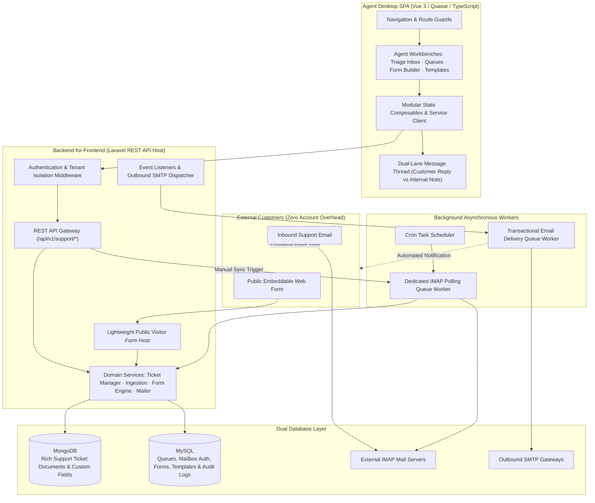

## Executive Summary

**Service Desk** is a high-throughput, multi-tenant customer support and helpdesk platform. Built **full-stack**, it provides a modern **Vue 3 / Quasar SPA workbench** for customer support teams and a scalable **Laravel Backend-for-Frontend (BFF)** handling automated email synchronization, queue workers, and public web form ingestion.

**Support agents** work inside a desktop SPA featuring a Gmail-style triage inbox with split-pane ticket inspection, advanced multi-attribute filtering (queues, tags, assignees, search), file attachments, and a dual-lane messaging interface offering **Public Customer Replies** alongside **Private Internal Team Notes**. **Administrators** manage **support queues** (stream assignment, routing rules, team permissions), **inbox mailboxes** (IMAP/SMTP connection wizard, health checks, manual sync), **public web forms** (visual drag-and-drop form builder, custom theme styling, reCAPTCHA anti-spam), and **templated automated emails** (auto-acknowledgements, ticket confirmation links).

**External customers never need an account.** They submit inquiries seamlessly via **email** (automated background IMAP parsing into structured tickets) or **public web forms** (lightweight server-rendered visitor pages with double opt-in verification). Inquiries persist with rich custom metadata in **MongoDB**, while core relational configurations, user roles, and mailbox credentials reside in **MySQL**.

---

## Architecture

### System Topology & Ingestion Pipeline

---

## Technical Architecture Breakdown

### Frontend Engineering (Vue 3 / Quasar SPA)

| Functional Area | Engineering Implementation |
|---|---|
| **Routing & Navigation** | 11 authenticated routes under `/service-desk/*` with strict permission guards |
| **State Management** | Scoped modular composables with automatic tenant cache reset on workspace switch |
| **API Client Layer** | Structured REST service layer communicating with dedicated `/api/v1/support` endpoints |
| **RBAC Security** | Granular action-based access control checking user roles before rendering sensitive actions |
| **Triage Inbox** | High-performance split-pane inbox with dynamic sorting, filtering, and load-more pagination |
| **Stream Management** | Multi-tab queue administration for routing rules, notification preferences, and team assignments |
| **Visual Form Builder** | Drag-and-drop custom field builder with live preview, routing config, and embed code generator |

---

### Backend Engineering (Laravel BFF & Background Pipeline)

| Functional Area | Engineering Implementation |
|---|---|
| **API Gateway** | RESTful `/api/v1/support` endpoints serving dedicated agent queries and mutations |
| **Ticket Persistence** | Document-based persistence in MongoDB enabling flexible schemas, arbitrary tags, and nested custom fields |
| **Email Ingestion Engine** | Asynchronous IMAP sync with RFC-compliant threading (`In-Reply-To`, `References`, hash detection) |
| **Public Form Ingress** | Double opt-in verification service with cryptographic token validation, honeypots, and rate limiters |
| **Outbound Email Pipeline** | Event-driven queued transactional mailers sending branded customer updates and auto-acknowledgements |
| **Granular RBAC** | Backend authorization gates enforcing `support.view`, `create`, `edit`, `assign`, `delete`, and `config` |
| **Public Form Runtime** | Ultra-lightweight server-rendered HTML forms designed for high-speed iframe embeds |

---

## Channel → Ticket Ingestion Lifecycle

| Ingestion Channel | Ingress Mechanism | Ticket Channel Tag | Agent Workflow |
|---|---|---|---|
| **Manual Creation** | `POST /support/tickets` | `manual` | Agent creates ticket directly during phone or in-person support |
| **Email Ingestion** | Asynchronous IMAP Polling Job | `email` | Automated parsing into ticket thread with customer reply lanes |
| **Public Web Form** | Web Form API with optional email verification | `form` | Verified submissions convert into tickets with custom field tables |

---

## Visual Workflows & Production Interfaces

### 1. Split-Pane Agent Inbox & Threaded Detail View
![Service Desk Agent Inbox Split View [desktop]](/images/projects/service-desk/inbox-ticket-detail.webp#desktop)

### 2. Multi-Channel Ticket Queue & Filter View
![Service Desk All Tickets Queue [desktop]](/images/projects/service-desk/inbox-tickets-list.webp#desktop)

### 3. Public Web Form Field Builder
![Service Desk Form Builder Questions [desktop]](/images/projects/service-desk/form-builder-questions.webp#desktop)

### 4. Public Form Routing & Mailbox Settings
![Service Desk Form Builder Settings [desktop]](/images/projects/service-desk/form-builder-settings.webp#desktop)

### 5. Multi-Channel Email Template & Auto-Ack Editor
![Service Desk Email Template Editor [desktop]](/images/projects/service-desk/email-template-editor.webp#desktop)

---

## Full-Stack Ownership Map

| Architecture Layer | Core Responsibilities | Key Technologies |
|---|---|---|
| **Frontend UI & Workbenches** | Inbox triage, queue administration, form builder, email template editor | Vue 3, Quasar Framework, TypeScript |
| **Frontend State & Services** | Modular state composables, HTTP client services, RBAC UI gates | Vue Composables, Axios REST Client |
| **Backend REST API** | Request validation, resource serialization, tenant isolation middleware | Laravel 11, Laravel Sanctum |
| **Domain Services** | Ticket lifecycle management, IMAP parser, email thread matcher, form builder | PHP 8.3 Services, MongoDB ODM |
| **Asynchronous Workers** | Scheduled mailbox polling, email dispatching, deduplication pipelines | Laravel Queues, Redis / MySQL Queue |
| **Public Visitor Surface** | High-performance embeddable forms, anti-spam filters, double opt-in confirmation | Server-rendered HTML, JavaScript, reCAPTCHA |
