# Thrift App — Case Study

**Role:** Full-Stack Mobile Developer  
**Timeline:** 2025 — Present  
**Status:** Active Production (v1.0.5)  
**Parent Platform:** [TradeflowBD](https://tradeflowbd.com) — Thrift Vertical  
**Repo:** [github.com/marceldavidbaroi](https://github.com/marceldavidbaroi)

---

## At a Glance

| | |
|---|---|
| **What it is** | Mobile warehouse companion for second-hand / thrift retail inventory |
| **Who it's for** | Warehouse operators registering inbound garments and performing shelf audits |
| **Core problem** | Desktop-only stock registration and paper stock checks can't keep up with shipment intake |
| **How it's built** | Quasar + Capacitor 8 Android app → Supabase RPCs + Cloudinary images |
| **Relationship** | Mobile field app for the Thrift vertical inside TradeflowBD ERP |

---

## The Problem

TradeflowBD's Thrift vertical handles second-hand garment retail — inbound consignment shipments, unique SKU barcodes, garment measurements, landed costing, POS sales, and returns. The web admin (`/:slug/app/thrift/*`) covers the full lifecycle, but warehouse floor work exposed critical gaps:

### Pain points on the warehouse floor

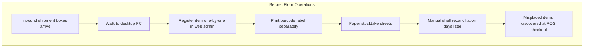

| Pain Point | Business Impact |
|---|---|
| **Desktop-bound registration** | Operators leave the shelf to use a PC — slows intake to ~2–3 items/minute |
| **No mobile barcode lookup** | Finding an item's status requires logging into the web admin |
| **Paper stock audits** | Human error in counting; no real-time discrepancy detection |
| **Misplaced stock invisible** | Items scanned at wrong shelf/box sit undetected until a sale fails |
| **English-only UI** | Bangladeshi warehouse staff need Bengali labels for daily workflows |
| **No scan feedback** | In noisy warehouses, operators can't tell if a scan succeeded without checking the screen |

### The core question

> How do you let warehouse staff register garments, scan barcodes, audit shelves, and fix misplaced stock — all from a phone at the shelf — while keeping the TradeflowBD web admin in sync?

---

## The Solution

**Thrift App** is a Capacitor Android companion (also runs as a responsive web SPA) that connects to the same Supabase backend as TradeflowBD's Thrift vertical. It handles the warehouse-floor workflows the web admin was never designed for.

### Five core workflows

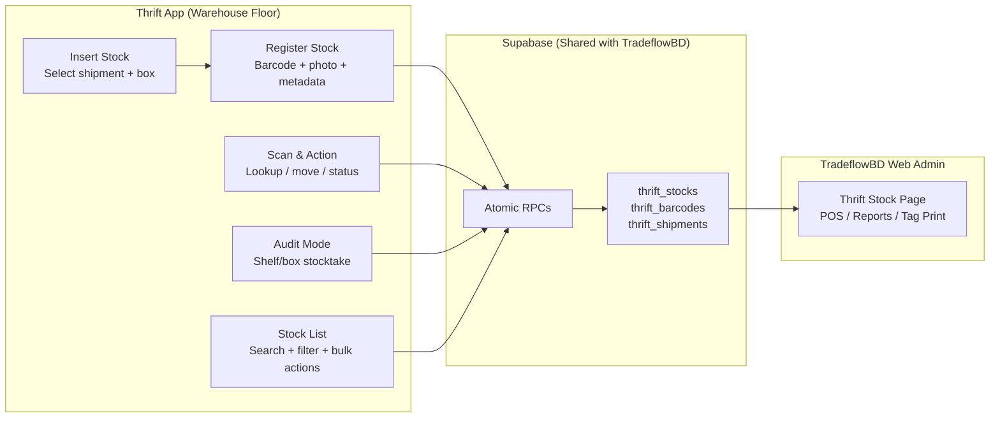

| Workflow | Route | What it does |
|---|---|---|
| **Dashboard** | `/` | Daily KPIs (items added today, total inventory, available stock) + quick action tiles |
| **Insert Stock** | `/insert-stock` | Pick active shipment and box context for intake session |
| **Register Stock** | `/register-stock` | Scan/create barcode, capture product photo, enter metadata, register via RPC |
| **Scan & Action** | `/scan-barcode` | Single or continuous scan → lookup, move shelf, change status, bulk queue |
| **Audit Mode** | `/audit-mode` | Shelf/box stocktake with verified / missing / misplaced detection |
| **Stock List** | `/stock-list` | Searchable inventory with status, condition, shelf/box filters |


---

## Architecture

### System design

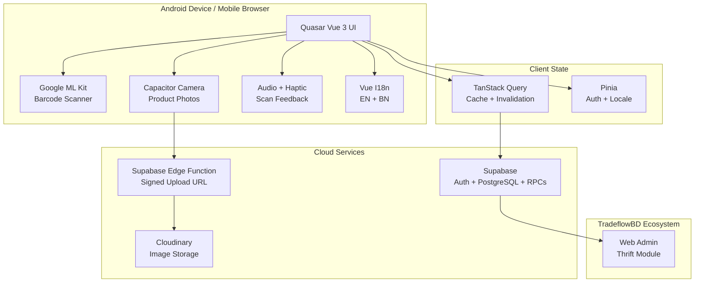

### Mobile build pipeline

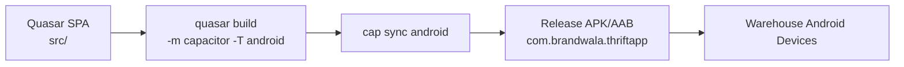

---

## Barcode Scanning Architecture

The scanning layer uses a dual-strategy approach for reliability across Android devices.

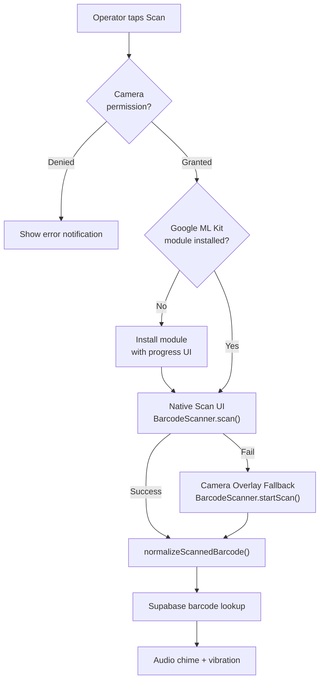

### Scan modes

| Mode | Behavior | Use Case |
|---|---|---|
| **Single Scan** | Scan → show item detail card → action (move, status change) | One-off lookup or correction |
| **Continuous Scan** | Scan repeatedly → items queue up → batch move or batch status update | High-volume intake or bulk corrections |


### Scan feedback system

```text
Success → 880Hz double-tone chime + 80ms vibration
Error   → 220Hz sawtooth beep + [100, 50, 100]ms vibration pattern
```

Operators get instant confirmation without looking at the screen — critical in noisy warehouse environments.

---

## Audit Mode — Stocktake Workflow

The most operationally impactful feature. Replaces paper stock checks with a structured digital workflow.

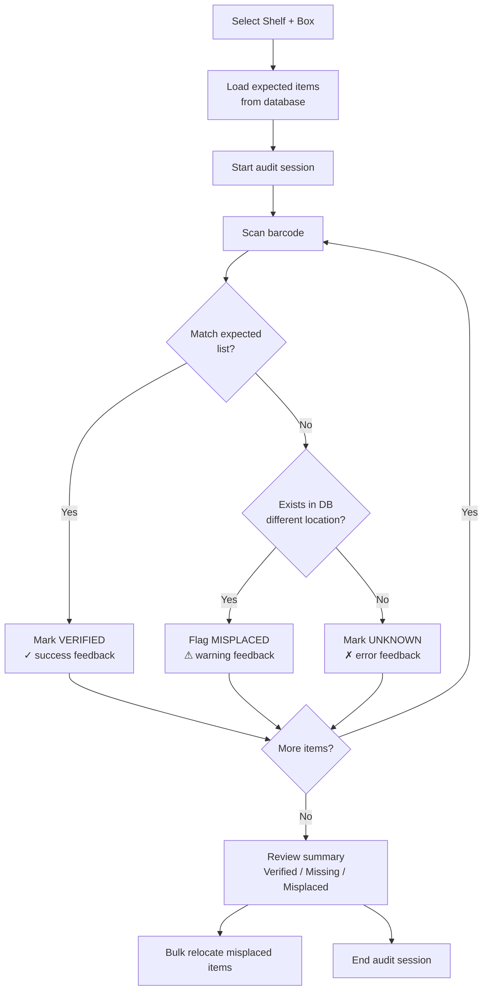

### Discrepancy types

| Status | Meaning | Action |
|---|---|---|
| **VERIFIED** | Scanned item matches expected shelf/box | Auto-marked on scan |
| **MISSING** | Expected item not scanned during session | Flagged in summary |
| **MISPLACED** | Item exists in DB but at wrong shelf/box | One-tap or bulk relocate to current audit location |

---

## Stock Registration Flow

Full garment intake at the warehouse shelf — no desktop required.


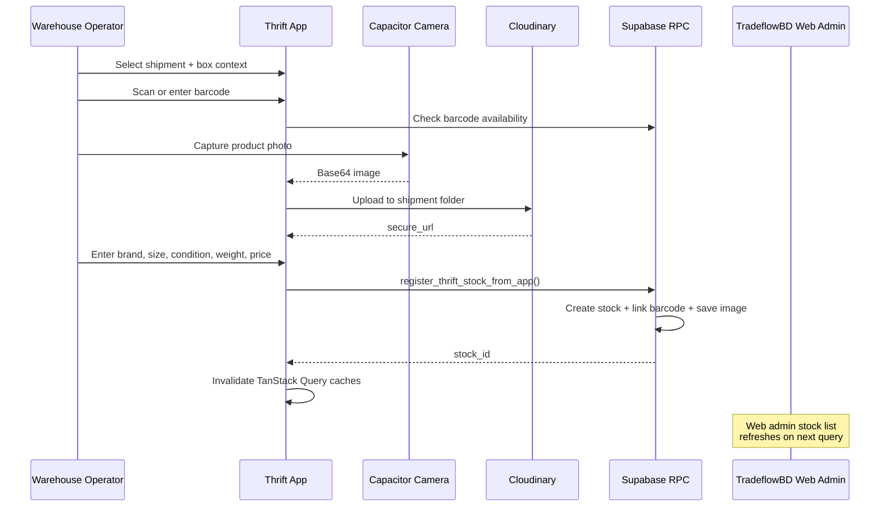

### Registration captures

- Barcode (scanned or manual)
- Product photo (camera with optional crop/edit)
- Brand, category, type, color, size, condition
- Shelf and box location
- Product weight + extra weight (for landed cost apportionment)
- Origin unit price + listed sell price
- Shipment and box context (auto-linked)

---

## Data Sync Strategy

> **Note:** The app does **not** use Supabase Realtime WebSocket channels. Sync is achieved through TanStack Query cache invalidation after every mutation.

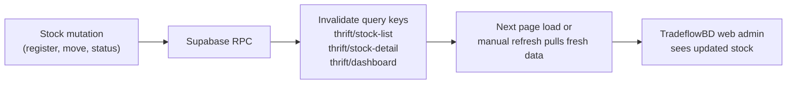

| Query Key | Data | Invalidated On |
|---|---|---|
| `thrift/stock-list` | Paginated inventory | Register, update, bulk move, bulk status |
| `thrift/stock-detail/:id` | Single item detail | Update location, status |
| `thrift/dashboard` | Daily KPI metrics | Stock registration |
| `thrift/barcodes` | Barcode pool | Create, delete barcode |

---

## Authentication

Dual-path auth for web and native Android.

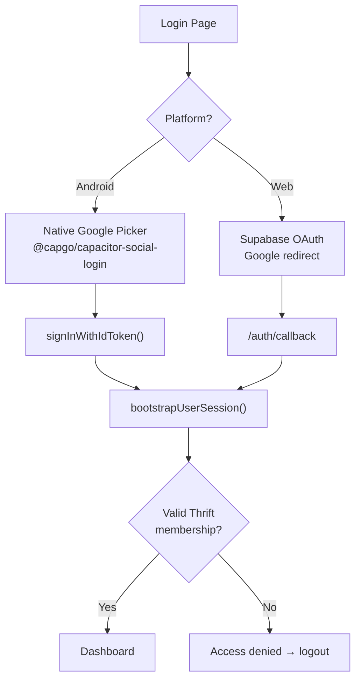

---

## Core Technical Decisions

### Decision 1 — Google ML Kit over web-based decoders

| | |
|---|---|
| **Problem** | JavaScript barcode libraries struggle with Code-128 thermal labels in low light, at angles, and on curved garment hang-tags. |
| **Decision** | Use `@capacitor-mlkit/barcode-scanning` which wraps Google's on-device ML Kit scanner with auto-zoom, native UI, and a camera overlay fallback. |
| **Outcome** | Hardware-accelerated decoding on Android with graceful degradation when the native scan UI is unavailable. |

---

### Decision 2 — Continuous scan queue for batch operations

| | |
|---|---|
| **Problem** | Registering or relocating 50+ items during shipment intake requires scanning each item, navigating a form, and saving — far too slow. |
| **Decision** | Continuous scan mode builds a queue of scanned items. Operators batch-apply shelf moves or status changes via `bulk_update_thrift_stock_locations` and `bulk_update_thrift_stock_statuses` RPCs. |
| **Outcome** | Scan many, act once. Bulk operations complete in a single database round-trip. |

---

### Decision 3 — Audit mode with three-tier discrepancy detection

| | |
|---|---|
| **Problem** | Paper stocktakes can't detect items physically present but logged at the wrong shelf — the most common warehouse error. |
| **Decision** | Audit mode loads expected items for a shelf/box, then on each scan: match → verified, no match but exists elsewhere → misplaced (with one-tap relocate), not in DB → unknown. |
| **Outcome** | Structured stocktake with real-time progress bar and actionable discrepancy summary. |

---

### Decision 4 — Atomic RPC registration, not client-side inserts

| | |
|---|---|
| **Problem** | Stock registration touches `thrift_stocks`, `thrift_barcodes`, and `thrift_stock_images` — partial client writes leave orphaned records. |
| **Decision** | Single `register_thrift_stock_from_app` RPC handles the full registration atomically. Image upload to Cloudinary happens first; the RPC receives the `secure_url`. |
| **Outcome** | No partial registrations. Duplicate barcode/image detection before write. |

---

### Decision 5 — Bilingual UI for warehouse operators

| | |
|---|---|
| **Problem** | Warehouse staff in Bangladesh are more productive in Bengali, but the tech stack is English-first. |
| **Decision** | Full Vue I18n integration with English and Bengali (বাংলা), persisted locale preference, covering all operator-facing workflows including help dialogs. |
| **Outcome** | Operators use the app in their preferred language without a separate build. |

---

### Decision 6 — Audio + haptic scan feedback

| | |
|---|---|
| **Problem** | In noisy warehouses, operators can't hear notification sounds or see the screen while handling garments. |
| **Decision** | Web Audio API success/error tones + `navigator.vibrate()` haptic patterns triggered on every scan result via `triggerScanFeedback()`. |
| **Outcome** | Instant tactile and audio confirmation — success feels different from error without looking at the device. |

---

## Tech Stack

| Layer | Technology | Role |
|---|---|---|
| **UI Framework** | Quasar 2 + Vue 3.5 + TypeScript | Mobile-first SPA, shared web + native |
| **Mobile Runtime** | Capacitor 8 | Android native shell, camera, haptics |
| **Barcode** | @capacitor-mlkit/barcode-scanning | Google ML Kit on-device decoding |
| **Camera** | @capacitor/camera | Product photo capture with crop/edit |
| **Auth** | Supabase Auth + @capgo/capacitor-social-login | Web OAuth + native Google ID token |
| **Server State** | TanStack Query v5 | Query caching, mutation invalidation |
| **Client State** | Pinia | Auth session, locale preference |
| **i18n** | Vue I18n v10 | English + Bengali |
| **Images** | Cloudinary (via Edge Function) | Shipment-scoped folder upload |
| **Backend** | Supabase PostgreSQL + RPCs | Shared with TradeflowBD Thrift vertical |
| **Icons** | Phosphor Icons | Consistent iconography |
| **Build** | Quasar Vite + Capacitor CLI | `build:android` → release APK/AAB |

---

## Relationship to TradeflowBD

Thrift App is the **mobile field layer** of the TradeflowBD Thrift vertical — not a standalone product.

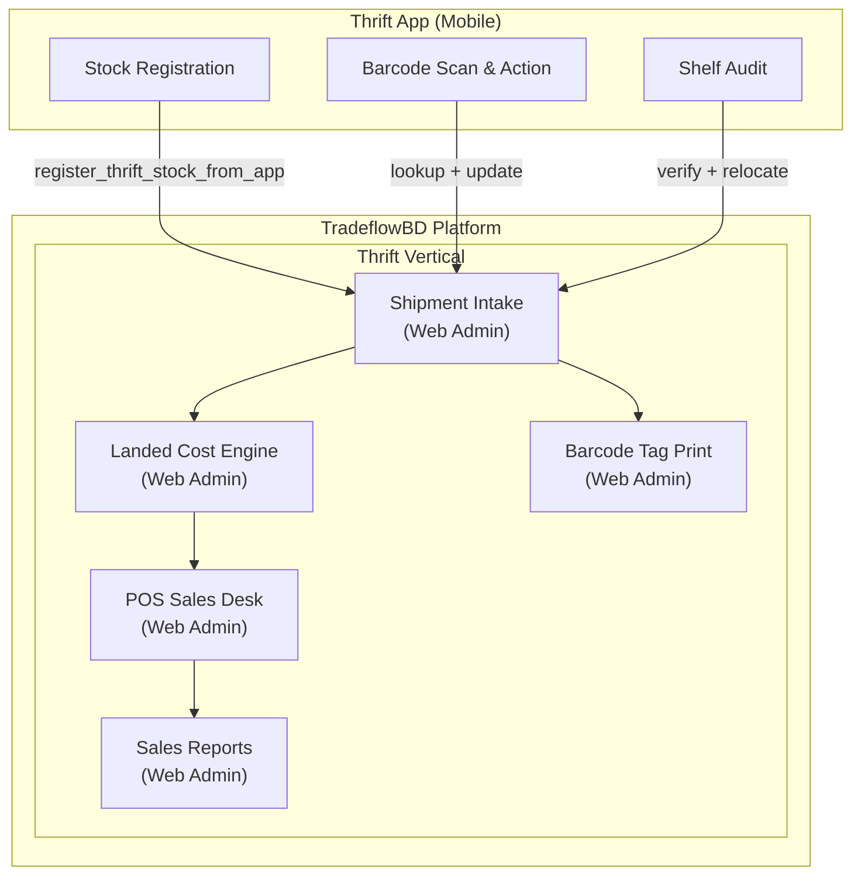

| Layer | Runs On | Handles |
|---|---|---|
| **Thrift App (mobile)** | Android phone at warehouse shelf | Registration, scanning, audit, quick status/location changes |
| **TradeflowBD web admin** | Desktop browser | Shipment costing, POS invoicing, tag printing, returns, reports, investor yield |

---

## What I Built

- **Barcode scanning engine** — ML Kit integration with module auto-install, native UI + overlay fallback, barcode normalization, and audio/haptic feedback
- **Stock registration workflow** — End-to-end mobile intake: barcode → photo → metadata → Cloudinary upload → atomic RPC
- **Continuous scan + bulk queue** — Batch shelf moves and status updates via bulk RPCs
- **Audit mode** — Full stocktake workflow with verified/missing/misplaced detection and bulk relocation
- **Bilingual operator UI** — English and Bengali across all workflows with persisted locale
- **Native Android auth** — Google Sign-In via ID token (no Custom Tab redirect on Android)

---

## Visual Workflows & Mobile Wireframes

### 1. Mobile Warehouse Scanner & Inventory Wireframes

```
+-----------------------------------+    +-----------------------------------+
| [=] Thrift App  [#] [EN v]  (D)   |    | [=] Thrift App  [#] [EN v]  (D)   |
+-----------------------------------+    +-----------------------------------+
| Warehouse Overview     (?) (Sync) |    | Barcode Scanner               (?) |
| Sat, Aug 29, 2026 * Thrift        |    |                                   |
|                                   |    | [Q] Single Scan            ( o )  |
| QUICK ACTIONS                     |    | +-------------------------------+ |
| +-------------------------------+ |    | |   [#] SINGLE SCAN             | |
| | (+) Insert New Item        >  | |    | +-------------------------------+ |
| |     Register stock manually   | |    |                                   |
| +-------------------------------+ |    | Enter or scan barcode:            |
| | [#] Scan & Action          >  | |    | +--------------------------+----+ |
| |     Continuous batch scanning | |    | | 16-AA-26-000101          | [Q]| |
| +-------------------------------+ |    | +--------------------------+----+ |
| | [=] View Inventory         >  | |    |                                   |
| |     Browse full stock list    | |    | +-- SCANNED ITEM CARD -----------+|
| +-------------------------------+ |    | | [IMG] NEXT Corduroy Jacket     ||
| | [*] Inventory Audit        >  | |    | |       Sz 12 | Bust: 34" L: 22" ||
| |     Shelf & box stocktake     | |    | |       Loc: Shelf A-04 / Box 12 ||
| +-------------------------------+ |    | |       Landed: ৳2,850.00        ||
|                                   |    | +--------------------------------+|
| DAILY INVENTORY KPIs              |    |                                   |
| +-------------------------------+ |    | [ Move Shelf ]   [ Mark Damaged ] |
| | Items Added Today       [Cal] | |    |                                   |
| | 420 Pcs                       | |    |                                   |
| +-------------------------------+ |    |                                   |
+-----------------------------------+    +-----------------------------------+
| [Home]  [Scan]  [+]  [Audit] [Inv]|    | [Home]  [Scan]  [+]  [Audit] [Inv]|
+-----------------------------------+    +-----------------------------------+
        (A) Dashboard View                       (B) Scanner & Action View
```

### 2. Shelf Audit & Misplaced Item Detection Flow

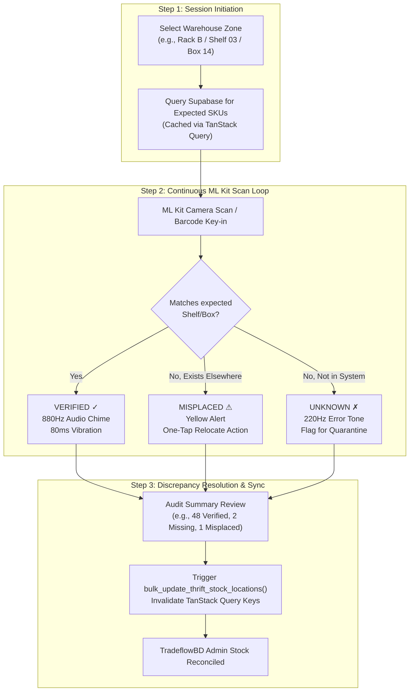

---

## Future Roadmap

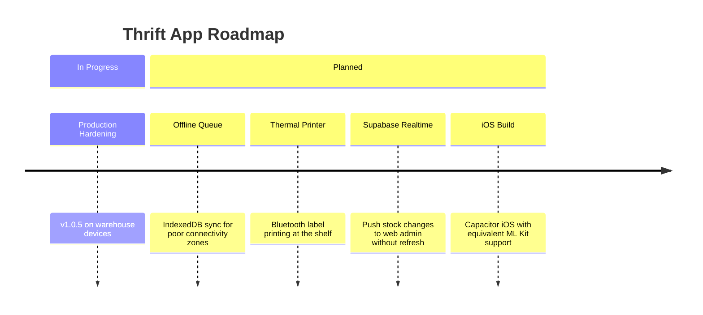

---

## Links

- **Parent Platform:** [tradeflowbd.com](https://tradeflowbd.com)
- **GitHub:** [github.com/marceldavidbaroi](https://github.com/marceldavidbaroi)

---

*Thrift App — Scan at the shelf. Register on the floor. Audit with confidence. Syncs with TradeflowBD.*
