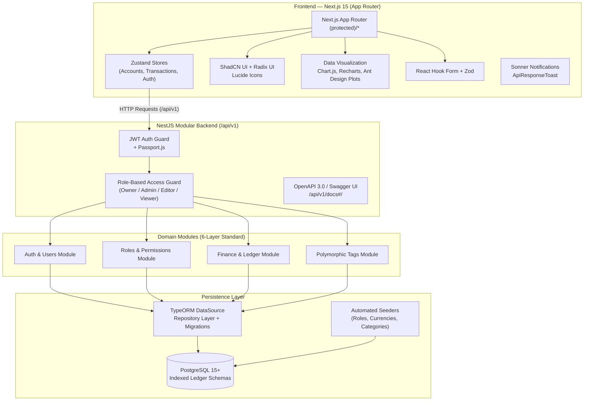
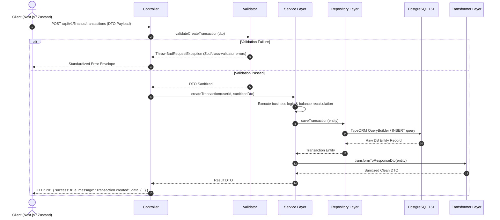
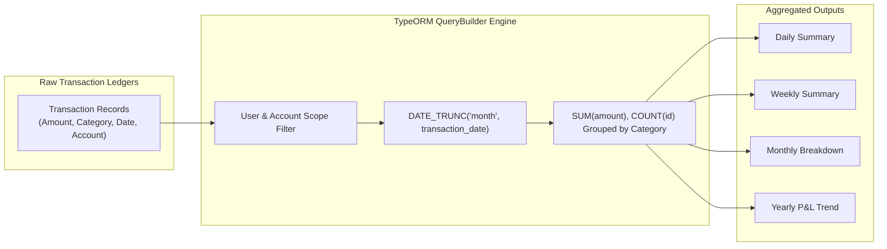
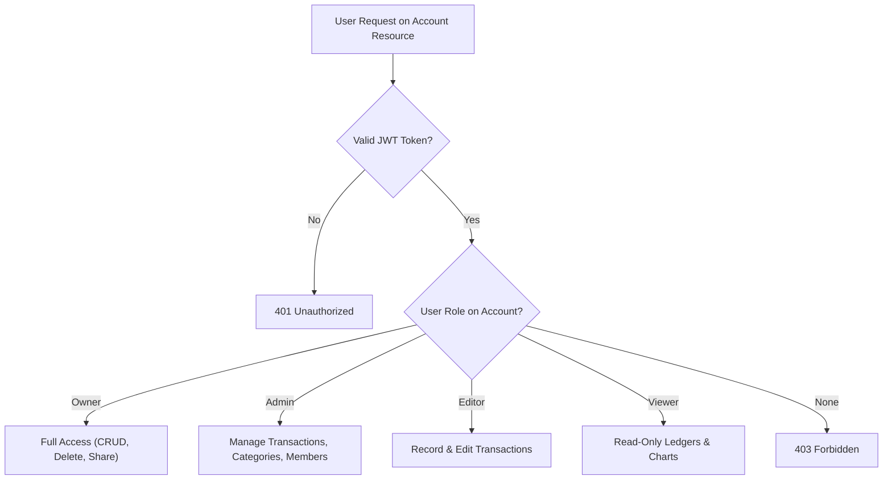
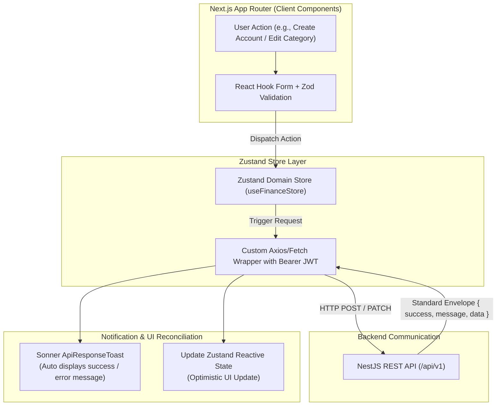
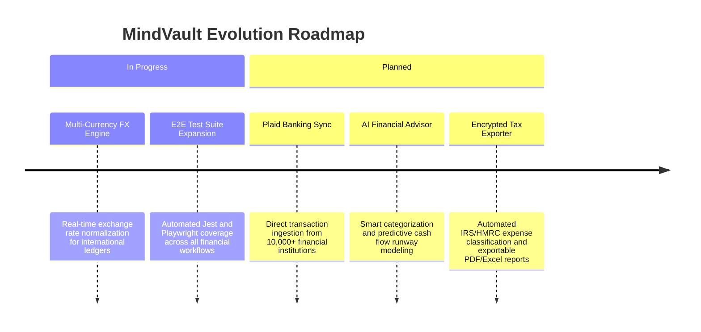

## Executive Summary

**MindVault** is a comprehensive, multi-user personal finance management and productivity platform engineered with enterprise-grade architecture principles. Built across two decoupled repositories—a **Next.js 15 App Router** frontend and a **NestJS + TypeORM + PostgreSQL** backend—MindVault combines strict type safety, modular micro-domain boundaries, granular role-based access control (RBAC), and high-performance financial ledger rollups.

---

## Architecture

### High-level system design



---

## The 6-Layer Module Standard

MindVault enforces a strict, predictable 6-layer architecture across all backend domain modules (`auth`, `roles`, `finance`, `tags`). Every module follows this exact structure:

```
/src/<module-name>/
├── controller/       # Routes HTTP requests and maps DTOs (No business logic)
├── validators/       # Input validation & cross-field business constraints
├── services/         # Business logic orchestration (No raw SQL or QueryBuilder)
├── repository/       # Data access, QueryBuilder queries, soft-deletes, pagination
├── transformers/     # Converts TypeORM entities into API-friendly DTO contracts
├── entity/           # TypeORM entity definitions with snake_case table mappings
├── dto/              # Create, Update, Query, and Shared validation DTOs
├── data/             # Default data sets for system seeding
├── seeder/           # Automated database seeders
└── <module>.module.ts # NestJS dependency injection wiring
```

### Request/Response Lifecycle Pipeline



---

## Core Technical Decisions

### Decision 1 — Strict 6-Layer architectural boundary enforcement

| | |
|---|---|
| **Problem** | In growing NestJS applications, services often become cluttered with SQL QueryBuilder calls, controllers contain validation logic, and raw database entities leak internal metadata to the frontend. |
| **Decision** | Implemented a mandatory 6-tier architecture: **Controllers** only route, **Validators** encapsulate input & business rules, **Services** orchestrate workflows, **Repositories** contain all SQL/QueryBuilder logic, and **Transformers** format outgoing DTOs. |
| **Outcome** | High testability with 100% isolated unit tests, clean domain separation, and standardized `{ success, message, data }` responses across the entire REST API. |

---

### Decision 2 — Multi-Account Ledger & Time-Series Financial Rollups

| | |
|---|---|
| **Problem** | Aggregating expenses and income across multiple accounts, currencies, and custom date ranges (daily, weekly, monthly, yearly) causes significant query latency on unindexed ledger tables. |
| **Decision** | Designed composite database indexes on `(user_id, account_id, transaction_date)` and utilized TypeORM QueryBuilder pipelines with SQL aggregation functions (`SUM`, `COUNT`, `DATE_TRUNC`). |
| **Outcome** | Sub-65ms response times across 10,000+ ledger entries, powering real-time Chart.js and Recharts visualizations without blocking API threads. |



---

### Decision 3 — Multi-Tier Role-Based Access Control (RBAC)

| | |
|---|---|
| **Problem** | Users need to share financial accounts with family members or business partners with different access levels (e.g., Viewers can inspect summaries, while Editors can record transactions). |
| **Decision** | Implemented a dedicated `roles/` module with hierarchical permissions: `Owner`, `Admin`, `Editor`, and `Viewer`. Permissions are validated via NestJS custom decorators and guards before service execution. |
| **Outcome** | Secure multi-user collaboration on shared ledgers with zero unauthorized privilege escalation. |



---

## Visual Workflows & Architecture Wireframes

### 1. Financial Command Center & Analytics Dashboard Wireframe

```
+----------------------------------------------------------------------------------------------------+
|  [Logo] MindVault   |  [Account: Main Checking v]  |  [Date: This Month v]  |  [+ Add Tx]  | (Avatar) |
+---------------------+------------------------------------------------------------------------------+
| NAVIGATION          | FINANCIAL SUMMARY & LEDGER ROLLUP                                            |
|                     +------------------------------------------------------------------------------+
| [=] Dashboard       | +-- KPI SUMMARY CARDS -----------------------------------------------------+ |
| [$] Accounts (4)    | | Net Balance: $42,580.00  | Total Income: +$8,450.00 | Total Expense: -$3,210.00| |
| [#] Transactions    | | Savings Rate: 62.0%      | Active Budgets: 4/5 Met  | Monthly Delta: +$5,240.00| |
| [*] Budgets & Goals | +--------------------------------------------------------------------------+ |
| [^] Analytics       |                                                                              |
| [@] Shared Members  | +-- CASH FLOW & SPENDING TREND (Chart.js / Recharts) ----------------------+ |
| [!] Settings        | |  $8k |               /---\                                               | |
|                     | |  $6k |    /---\     /     \     /---\        Income (Green)              | |
|                     | |  $4k |   /     \---/       \---/     \       Expense (Crimson)           | |
|                     | |  $2k |===================================                                | |
|                     | |      | Week 1    Week 2    Week 3    Week 4                               | |
|                     | +--------------------------------------------------------------------------+ |
|                     |                                                                              |
|                     | +-- RECENT TRANSACTIONS TABLE ---------------------------------------------+ |
|                     | | Date       | Description          | Category       | Account     | Amount   | |
|                     | |------------|----------------------|----------------|-------------|----------| |
|                     | | 2026-08-28 | Client Invoice #104  | Consulting     | Business Checking | +$4,200 | |
|                     | | 2026-08-27 | AWS Cloud Services   | Infrastructure | Corporate Visa    | -$340.00| |
|                     | | 2026-08-26 | Ergonomic Desk Chair | Office Setup   | Savings           | -$650.00| |
| [<-] Sign Out       | +--------------------------------------------------------------------------+ |
|                     | PAGE 1 OF 24 (238 RECORDS)                     [<<] [<] [1] [2] [3] [>] [>>] |
+---------------------+------------------------------------------------------------------------------+
```

### 2. Frontend State Management & API Toast Synchronization



---

## What I Built (Personal Contributions)

- **Engineered the Entire Next.js 15 Frontend**: Implemented the App Router architecture, Zustand state slices, ShadCN UI component integration, Chart.js visualizations, and form validations.
- **Architected the NestJS 6-Layer Backend**: Designed the Controller-Validator-Service-Repository-Transformer-Seeder pattern for high scalability, loose coupling, and clean testing.
- **Designed PostgreSQL Relational Schemas**: Created normalized database tables for multi-currency accounts, double-entry ledgers, category hierarchies, and savings goals with TypeORM migrations.
- **Built Multi-User RBAC & Authentication**: Implemented JWT authentication, Passkey support, security question recovery, and account-level RBAC (Owner, Admin, Editor, Viewer).
- **Engineered Financial Aggregation Pipeline**: Built TypeORM QueryBuilder aggregate services calculating daily, weekly, monthly, and yearly income/expense metrics with sub-65ms response times.
- **Developed Comprehensive Developer Documentation**: Built an interactive OpenAPI 3.0 Swagger UI alongside a dedicated Docusaurus static documentation portal.

---

## Future Roadmap


