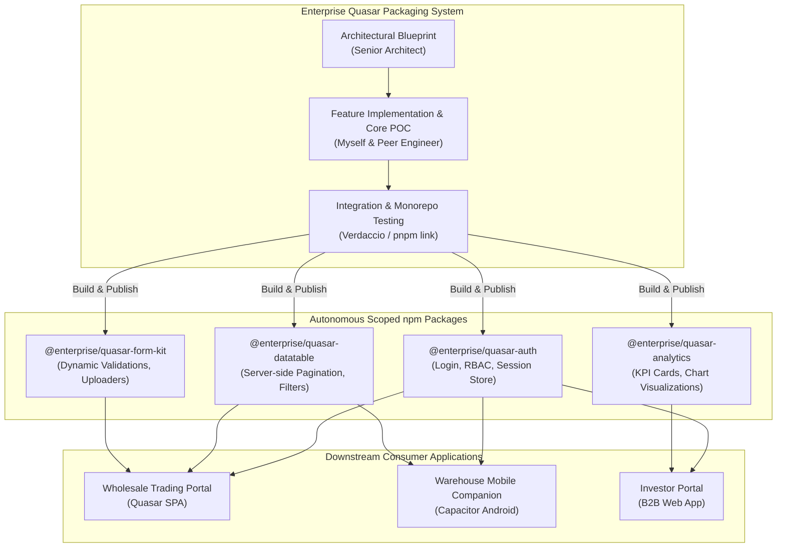
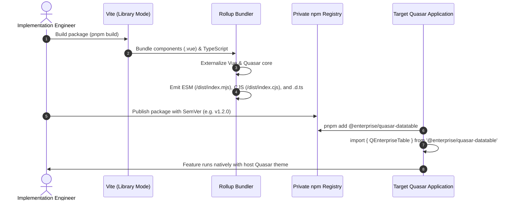
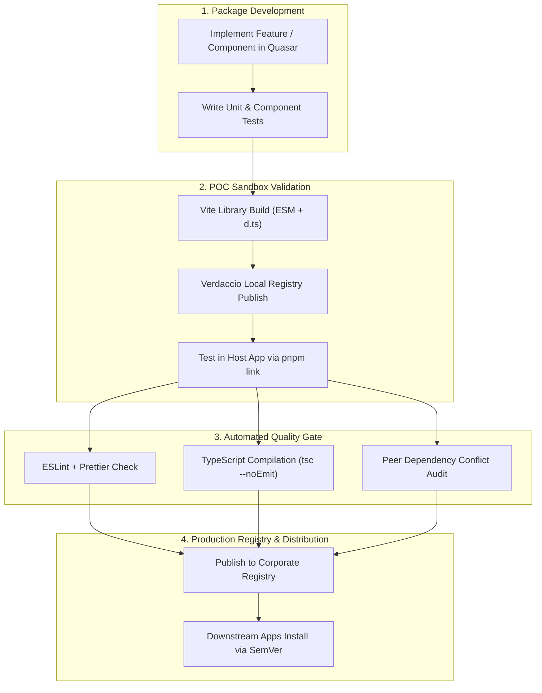
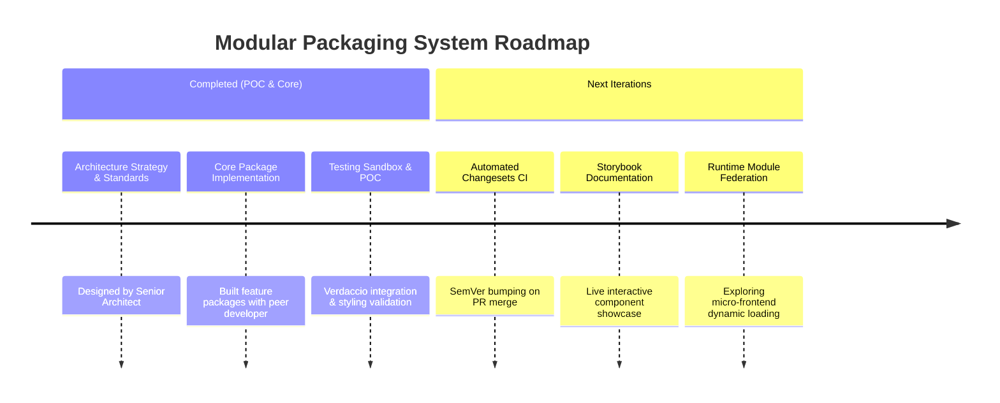

## Executive Summary

The **Enterprise Modular Packaging System** was built to dismantle monolithic Quasar web applications into independent, reusable npm packages. Rather than relying on fragile copy-pasting across client projects, every shared component, data-table widget, dialog, and business domain feature was transformed into an autonomous, version-controlled npm package.

While the high-level system architecture and strategy was laid out by the **Senior Systems Architect**, I—alongside a peer software engineer—served as the **core implementation and testing team**. We developed the actual feature packages, engineered the end-to-end **Proof of Concept (POC)**, resolved Quasar/Vite packaging quirks, and performed integration testing to validate that packages worked seamlessly in downstream client applications.

---

## Architecture

### Package Extraction & Consumption Topology



---

## The Packaging Standard & Vite Library Build

Each modular feature package is isolated with its own build pipeline, type definitions, and dependencies:

```
@enterprise/<package-name>/
├── src/
│   ├── components/      # Quasar UI components (.vue)
│   ├── composables/     # Reusable reactive logic & hooks
│   ├── stores/          # Pinia state stores
│   ├── types/           # TypeScript contracts & interfaces
│   └── index.ts         # Library entrypoint (exports & Quasar install plugin)
├── package.json         # Scoped package manifest, peerDependencies, exports
├── tsconfig.json        # Strict TypeScript configuration
├── vite.config.ts       # Vite library mode build (ESM + CJS + d.ts)
└── README.md            # Usage guide, prop tables, and integration examples
```

### Build & Export Lifecycle



---

## Proof of Concept (POC) & Core Testing

Before rolling out the packaging pattern across company products, we engineered a comprehensive Proof of Concept (POC) testing workflow to address key edge cases:

1. **Quasar Component Style Ingestion**:
   - Monolithic Quasar apps rely on Vite plugins to auto-import Quasar Sass variables and components. In an npm package, un-compiled Sass can break host builds.
   - **Solution Tested**: Configured packages to pre-bundle compiled CSS or export explicit CSS entrypoints (`dist/style.css`) that the host application imports during bootstrap.

2. **Peer Dependency De-duplication**:
   - Multiple packages importing different copies of `vue` or `quasar` cause runtime errors such as `provide/inject` failures and broken reactivity.
   - **Solution Tested**: Marked `vue`, `quasar`, and `pinia` as strict `peerDependencies` with `^3.x` and `^2.x` ranges, preventing duplicate instances in `node_modules`.

3. **Verdaccio Local Registry Integration Sandbox**:
   - Ran an on-premises Verdaccio registry instance to simulate real-world publishing, version upgrades, and breaking-change migrations before publishing to remote corporate registries.

---

## Visual Workflows & Architecture Wireframes

### 1. Consumer Application Composition Wireframe

```
+----------------------------------------------------------------------------------------------------+
|  [Logo] Host Quasar Application                                               | (User Profile)     |
+----------------------------------------------------------------------------------------------------+
|                                                                                                    |
|  [ FROM: @enterprise/quasar-auth ]                                                                |
|  +-- ACTIVE SESSION BAR -------------------------------------------------------------------------+ |
|  | Tenant: UK Import Corp   | Role: Senior Operations   | Session Token: VALID (Expires in 8h)   | |
|  +-----------------------------------------------------------------------------------------------+ |
|                                                                                                    |
|  [ FROM: @enterprise/quasar-analytics ]                                                           |
|  +-- MODULAR KPI DASHBOARD WIDGET ---------------------------------------------------------------+ |
|  | [ Card: Inbound Shipments (42) ] [ Card: Active Stock (14,200) ] [ Card: Margin Rollup (24%) ] | |
|  +-----------------------------------------------------------------------------------------------+ |
|                                                                                                    |
|  [ FROM: @enterprise/quasar-datatable ]                                                           |
|  +-- REUSABLE SERVER-SIDE DATA TABLE PACKAGE ----------------------------------------------------+ |
|  | Search: [ Type to filter...        ]  Columns: [v]  Export: [ Excel | CSV ]  [+ New Action]   | |
|  |-----------------------------------------------------------------------------------------------| |
|  | [x] | Batch ID    | Cargo Manifest        | Total Weight | Status       | Actions             | |
|  |-----|-------------|-----------------------|--------------|--------------|---------------------| |
|  | [ ] | #BT-2026-01 | Felixstowe Container 1| 12,400 kg    | IN_TRANSIT   | [View] [Edit] [Del] | |
|  | [ ] | #BT-2026-02 | Southampton Air Cargo | 1,850 kg     | RECEIVED     | [View] [Edit] [Del] | |
|  +-----------------------------------------------------------------------------------------------+ |
|  | Showing 1-20 of 140 Records                             [<<] [<] [1] [2] [3] [>] [>>]         | |
+----------------------------------------------------------------------------------------------------+
```

### 2. Package Lifecycle & QA Verification Loop



---

## What I Built (Personal Contributions)

In this project, the architectural direction was established by the **Senior Systems Architect**, while I worked alongside a peer developer on the practical implementation:

- **Implemented Feature Packages**: Extracted and built standalone Quasar packages for reusable components, data-tables, filter bars, and common business dialogs.
- **Built End-to-End POC Sandbox**: Created the local testing environment using Verdaccio and `pnpm workspaces` to validate package publishing, import paths, and tree-shaking.
- **Solved Quasar Style & Asset Bundling**: Resolved styling encapsulation issues, ensuring package components consumed the parent application's Quasar theme without duplicating global styles.
- **Engineered Core Integration Tests**: Created test suites to verify that updates to core packages maintained backwards compatibility with downstream production apps.
- **Created Package Starter Templates**: Authored template configurations (Vite build settings, TypeScript configurations, standard `package.json` export maps) for other engineering teams to adopt.

---

## Future Roadmap


