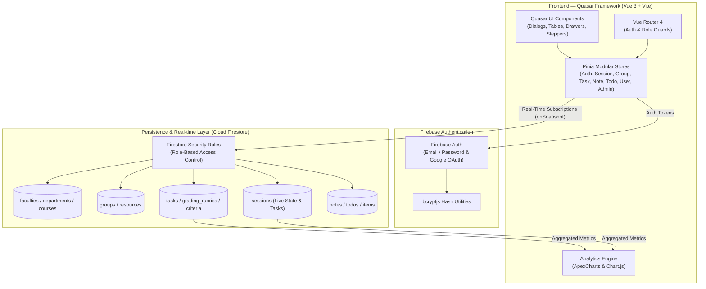
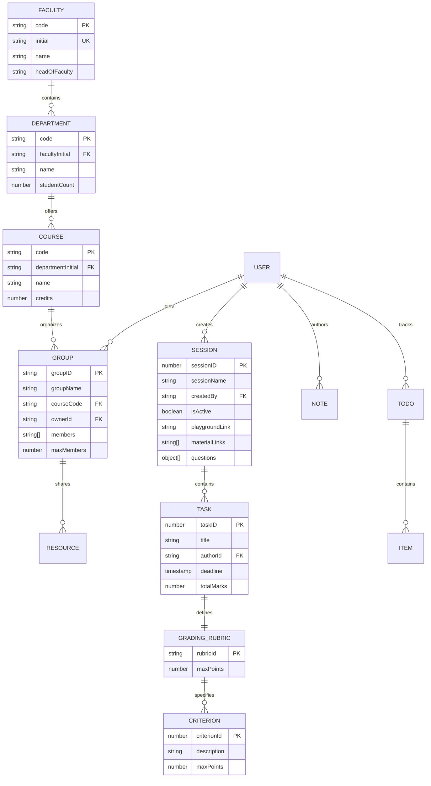
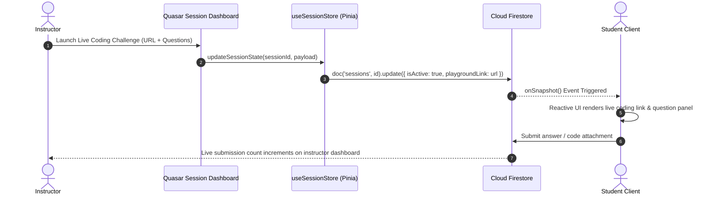
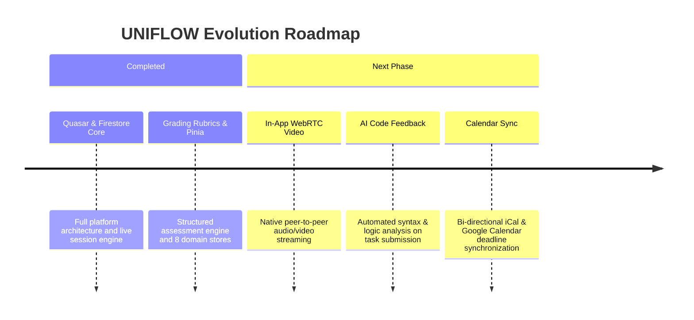

## Executive Summary

**UNIFLOW** is a real-time collaborative class management platform tailored for university students, faculty members, and academic administrators. Built on top of the **Quasar Framework (Vue 3)** and powered by **Firebase Firestore**, UNIFLOW centralizes lecture delivery, group collaboration, assignment submissions, code playground sharing, and smart note-taking into a single cohesive ecosystem.

---

## Architecture

### System Topology & Client-to-Cloud Flow



---

## Data Schema & Relationships

UNIFLOW models academic structures, real-time sessions, and grading rubrics inside Cloud Firestore:



---

## Core Technical Decisions

### Decision 1 — Pinia Modular Domain Stores with Persisted State

| | |
|---|---|
| **Problem** | Managing complex client state for 8 distinct domains (Auth, Sessions, Groups, Tasks, Notes, Todos, Users, Admin) inside a large single-page app causes bloated state and data loss on browser refresh. |
| **Decision** | Segmented state management into 8 independent Pinia stores (`useAuthStore`, `useSessionStore`, `useGroupStore`, `useTaskStore`, `useNoteStore`, `useTodoStore`, `useUserStore`, `useAdminStore`) integrated with `pinia-plugin-persistedstate`. |
| **Outcome** | Clean domain isolation, zero cross-store coupling, and instant session rehydration when navigating across university portals. |

---

### Decision 2 — Real-Time Active Classroom State Synchronization

| | |
|---|---|
| **Problem** | Instructors need to toggle live coding playgrounds, launch questions, and share real-time reference links during lectures without asking students to manually refresh pages. |
| **Decision** | Utilized Firestore `onSnapshot` listeners bound to active `sessionID` documents. State mutations by the teacher immediately propagate to all connected student clients in sub-second latency. |
| **Outcome** | True real-time classroom interactivity with live participant counters, instant question prompts, and synchronized external coding links. |



---

## Visual Workflows & Architecture Wireframes

### 1. Interactive Class Session Wireframe

```
+----------------------------------------------------------------------------------------------------+
|  [Logo] UNIFLOW               |  [Classes]  |  [Groups]  |  [Tasks]  |  [Notes]    | (Profile: Teacher)|
+----------------------------------------------------------------------------------------------------+
|                                                                                                    |
|  SESSION: CS401 — Advanced Distributed Systems (Live Active)               [ End Session Button ]  |
|                                                                                                    |
|  +-- INTERACTIVE LECTURE WORKSPACE --------------------------------------------------------------+ |
|  |                                                                                               | |
|  |  +-- CODING PLAYGROUND EMBED --------------+  +-- LIVE QUESTION & TASK QUEUE ---------------+ | |
|  |  | Playground Link: [ compiler.io/p/cs401 ] |  | Q1. Implement Raft Consensus Leader Election | |
|  |  | Mode: Interactive Live Collaboration      |  | Marks: [ 10 Pts ]  | Time Limit: [ 15 Mins ] | |
|  |  | Status: [ ACTIVE - 42 Students Joined ]  |  | Submissions Received: 28 / 42                | |
|  |  |                                         |  +---------------------------------------------+ | |
|  |  | [ Open in Fullscreen ] [ Share Screen ] |  | Attached Resources:                         | | |
|  |  |                                         |  | - [PDF] raft-extended.pdf                   | | |
|  |  |                                         |  | - [Video] MIT 6.824 Lecture 06              | | |
|  |  +-----------------------------------------+  +---------------------------------------------+ | |
|  +-----------------------------------------------------------------------------------------------+ |
|                                                                                                    |
|  +-- CONNECTED PARTICIPANTS & STUDY GROUPS (42 Online) -------------------------------------------+ |
|  | [x] Group A (Lab 1) - 4/4 Online | [x] Group B (Lab 1) - 4/4 Online | [x] Group C (Lab 2) - 3/4 Online |
|  +-----------------------------------------------------------------------------------------------+ |
+----------------------------------------------------------------------------------------------------+
```

### 2. Multi-Criterion Grading Rubric Matrix

```
+-- ASSIGNMENT GRADING RUBRIC BUILDER -------------------------------------------------------------+
| Task: Distributed Key-Value Store Submission           | Total Marks: 100 Pts                    |
+--------------------------------------------------------------------------------------------------+
| #   | Criterion Description                       | Max Points | Evaluation Notes                |
|-----|---------------------------------------------|------------|---------------------------------|
| 01  | RPC Network Protocol & Heartbeat Handling   | 30 Pts     | Handles network partition drop  |
| 02  | Concurrent Data Serialization & Mutex Locks | 30 Pts     | Race condition prevention       |
| 03  | Unit & Integration Test Coverage            | 20 Pts     | Min 85% branch coverage passed  |
| 04  | Code Quality & Architecture Documentation   | 20 Pts     | Clean modular abstractions      |
+--------------------------------------------------------------------------------------------------+
| Settings: [x] Allow Late Submissions (-5% per day)  | [x] Enable Peer Review (2 Reviewers/Student)|
+--------------------------------------------------------------------------------------------------+
```

---

## What I Built (Personal Contributions)

- **Engineered Full-Stack Quasar SPA**: Developed modular components, routes, and responsive UI layouts using Quasar Framework v2 and Vue 3.
- **Architected Firestore Document Schemas**: Designed 4-tier relational document schemas, nested collections, and optimized queries for Faculties, Departments, Courses, Groups, and Sessions.
- **Implemented 8 Modular Pinia Stores**: Built domain-isolated state stores with persisted local state caching (`pinia-plugin-persistedstate`).
- **Built Live Interactive Session Engine**: Wired real-time Firestore listeners (`onSnapshot`) to sync coding playground URLs, questions, and material links across active sessions.
- **Developed Structured Assignment Rubrics**: Engineered the multi-criterion assignment grading system with customizable evaluation weights and peer-review toggle flags.
- **Integrated Institutional Analytics**: Built performance visualization dashboards utilizing ApexCharts and Chart.js to track student progress and session participation.

---

## Future Roadmap


