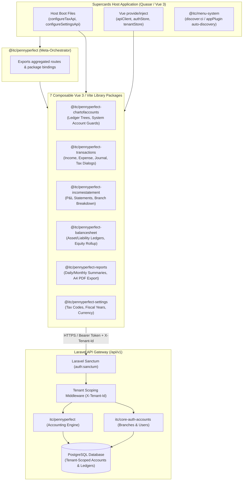
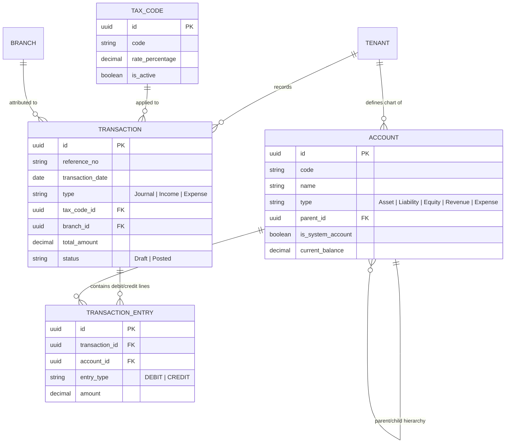
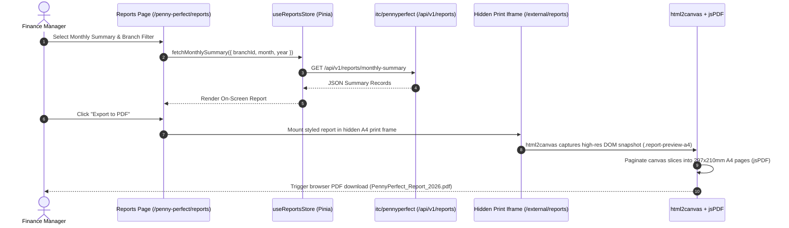

## Executive Summary

**PennyPerfect** is an enterprise modular double-entry accounting suite engineered for multi-tenant **Supercards** organizations. Rather than a monolithic ERP, PennyPerfect is architected as **seven composable frontend packages** (`@itc/pennyperfect-*`) that deliver dedicated accounting modules—from chart of accounts and journal transactions to balance sheets, income statements, and PDF reporting.

All packages are orchestrated by a meta-dependency package (`@itc/pennyperfect`), auto-discovered through `@itc/menu-system`, and powered by a consolidated Laravel package (`itc/pennyperfect`) operating under `/api/v1` with Sanctum authentication and strict tenant-scoping.

---

## Architecture

### Modular Package Composition & Host Ingestion Topology



---

## Package Architecture Standard

Each `@itc/pennyperfect-*` package is structured as an isolated, independently versioned Vite library package:

```
@itc/pennyperfect-<module>/
├── src/
│   ├── components/      # Quasar UI components, Dialogs, Trees
│   ├── pages/           # Root module pages mounted under /penny-perfect/*
│   ├── stores/          # Module Pinia stores (with persisted state if needed)
│   ├── services/        # HTTP API services (apiUrlBuilder + callApi / apiClient)
│   ├── types/           # TypeScript interfaces & DTO contracts
│   ├── router/          # routes.ts exporting RouteRecordRaw[]
│   └── index.ts         # appPlugin manifest (routes, menu, boot helpers)
├── package.json         # Scoped package manifest, peerDependencies
├── tsconfig.json        # TypeScript configuration
└── vite.config.ts       # Vite 7 library build (ESM + CJS)
```

---

## Data Schema & Accounting Ledger Flow

PennyPerfect enforces double-entry bookkeeping rules across all journal, income, and expense entries:



---

## Visual Workflows & Production Interfaces

### 1. Chart of Accounts Ledger Hierarchy


### 2. Multi-Tab Transactions & Tax Code Management


### 3. Financial Statements: Balance Sheet & Income Statement


### 4. Operational Financial Reports & Export


---

## Client-Side Report Preview & Multi-Page A4 PDF Assembly



---

## What I Built (Personal Contributions)

- **Engineered Multi-Package Frontend Architecture**: Decomposed the accounting system into 7 modular Vite/Vue 3 packages (`@itc/pennyperfect-*`) with standalone routes, Pinia stores, and Quasar UI pages.
- **P0 Authentication & Tax API Resolution**: Diagnosed and fixed boot-time tax endpoint failure that caused unexpected session logouts on page load by implementing `configureTaxApi` lazy configuration.
- **Standardized Host Provide/Inject Integration**: Implemented host boot providers for `apiClient`, `authStore`, and `tenantStore`, ensuring uniform Sanctum Bearer tokens and `X-Tenant-Id` header propagation.
- **Branch API Alignment**: Refactored branch loaders across statements and reports to consume `GET /tenants/{tenantId}/branches` from `itc/core-auth-accounts` and made branch fields nullable for flexible transactions.
- **Route & Menu Discovery Pipeline**: Streamlined `appPlugin.routes` and `@itc/menu-system` auto-discovery to expose 6 production accounting surfaces under the `/penny-perfect/*` hierarchy.
- **Client-Side PDF Generation Engine**: Designed an in-browser PDF export pipeline using hidden iframe rendering, `html2canvas`, and `jsPDF` for pixel-perfect A4 accounting statements without server rendering load.
