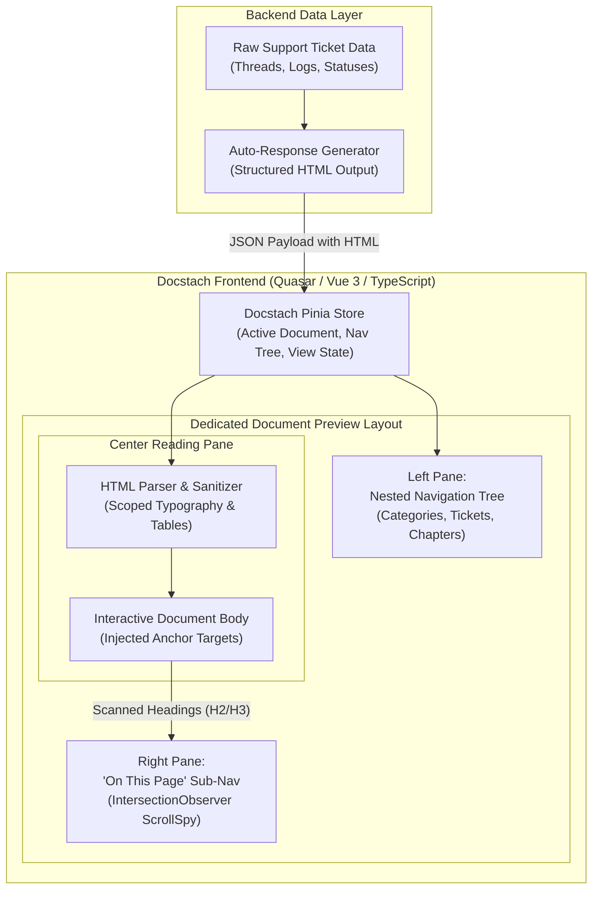

## Executive Summary

**Docstach** is an enterprise documentation engine engineered to convert raw customer support ticket data, incident logs, and resolution threads into standardized, interactive knowledge documentation. While the backend handles ticket aggregation and AI/templated response generation, I engineered the **entire frontend UI and document preview architecture** using the **Quasar Framework (Vue 3)** and **TypeScript**.

The preview interface provides a dedicated viewing experience with **multi-level nested navigation**, a **safe HTML document parser**, and a real-time **'On This Page' Table of Contents** that tracks reading progress.

---

## Architecture

### Frontend Preview Engine Topology

---

## Visual Workflows & Document Preview Interface

### Dedicated 3-Pane Document Preview Interface
![Docstach Document Preview Interface [desktop]](/images/projects/docstach/preview.webp#desktop)

---

## Core Technical Decisions

### Decision 1 — Dedicated Document Preview Layout vs Embedded Modal

| | |
|---|---|
| **Problem** | Displaying auto-generated ticket documents inside standard dashboard modals felt cramped, prevented deep-linking to sections, and lacked sufficient width for wide financial and technical tables. |
| **Decision** | Designed an independent **Document Preview Layout** in Quasar with collapsible sidebars, clean typography margins, and full viewport height utilization. |
| **Outcome** | Provided readers with a focused, book-like reading experience while maximizing horizontal space for dense tabular ticket logs. |

---

### Decision 2 — DOM-Scanned 'On This Page' Section Navigation

| | |
|---|---|
| **Problem** | Auto-generated ticket documentation can span thousands of words across dozens of technical subheadings; readers needed instant jumping without requiring the server to calculate heading offsets. |
| **Decision** | Implemented a client-side heading parser in Vue 3 that traverses the rendered `.doc-body` DOM, collects `<h2>` and `<h3>` tags, creates sluggified anchor IDs, and binds an `IntersectionObserver` to highlight the active section in real time. |
| **Outcome** | Zero backend overhead for table of contents generation and effortless navigation across lengthy technical incident summaries. |

---

### Decision 3 — Safe HTML Body Parsing & Scoped Typography

| | |
|---|---|
| **Problem** | Ingesting raw HTML generated from ticket histories risked CSS bleed (destroying layout styles) and potential cross-site scripting if ticket threads contained unescaped inputs. |
| **Decision** | Constructed an HTML sanitizer and parser pipeline that strips malicious script tags and applies strict `.docstach-prose` scoped styling to headings, tables, blockquotes, and code snippets. |
| **Outcome** | 100% resilient rendering of auto-generated responses with consistent enterprise typography and complete protection against CSS leakage. |

---

## What I Built (Personal Contributions)

- **Engineered Quasar Frontend UI**: Built the entire frontend interface and component architecture in Vue 3 and Quasar Framework.
- **Dedicated Document Preview Layout**: Designed the specialized 3-pane documentation layout isolating reading tools from administrative sidebars.
- **Hierarchical Nested Navigation Tree**: Created the recursive category, ticket, and chapter sidebar allowing instant traversal across ticket archives.
- **'On This Page' ScrollSpy Engine**: Implemented DOM heading extraction and real-time scroll tracking for sub-section navigation.
- **HTML Content Parser**: Built the rendering and sanitization layer that transforms raw auto-generated HTML responses into responsive, beautifully styled documentation.
