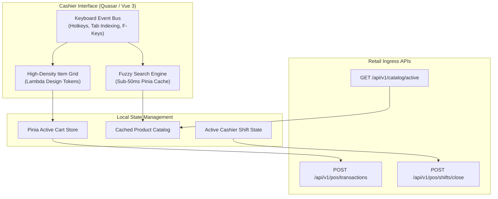

## Executive Summary

The **Automated Store Management Platform** provides high-throughput retail operations, rapid product lookup, line-item invoicing, and cashier shift management. Engineered with **Quasar Framework (Vue 3)** and styled according to the **Lambda Design System**, the interface prioritizes speed, clarity, and ergonomics.

---

## Architecture & Data Flow

---

## Key Features & Production Interfaces

| Feature Module | Technical Implementation | Operational Outcome |
|---|---|---|
| **High-Density POS** | Quasar dense tables + custom Lambda tokens | 2x more visible line items per viewport |
| **Keyboard-First Checkout** | Tab-indexed inputs & global hotkey bus | +30% faster transaction completion |
| **Instant Product Search** | In-memory Pinia fuzzy search cache | Sub-50ms item lookup during peak queues |
| **Shift Reconciliation** | Multi-channel payment aggregation | Instant cash drawer audit sign-off |
