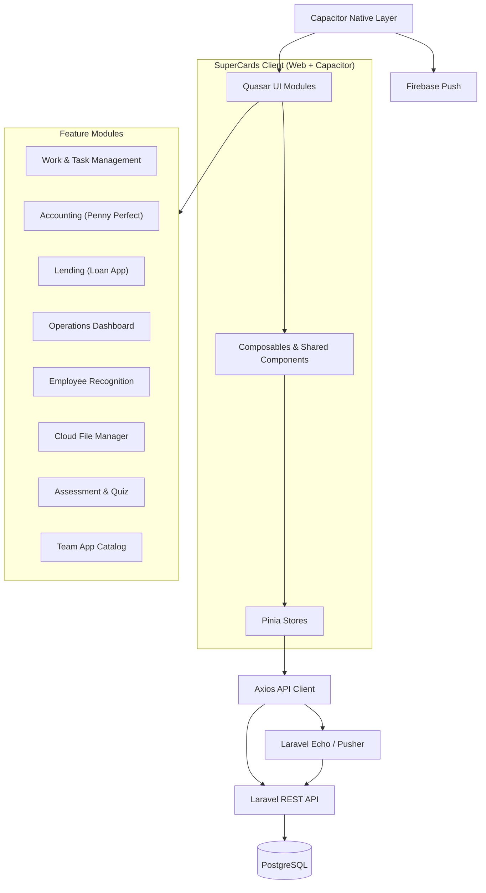

## Executive Summary

**SuperCards** is a multi-tenant enterprise platform that treats work items, financial records, loan accounts, quizzes, and internal applications as **cards** within a unified workspace. Organizations use it to run projects, meetings, microfinance operations, bookkeeping, employee recognition, assessments, and team-built tools from one authenticated shell.

My role as **Frontend Engineer** focused on shipping and hardening product surfaces across the platform — not isolated pages, but **reusable interaction patterns** (list → preview → detail → save) that multiple business domains share. Contribution depth varied by module: full ownership on work-item flows, accounting, and assessments; substantial partial delivery on lending, the home dashboard, recognition, file storage, and the team app catalog.

---

## Architecture

### System Topology & Client-to-Cloud Flow

### Modular Frontend Structure

Each business domain lives in an isolated module with its own routes, pages, and components, registered into a shared Quasar layout:

| Layer | Responsibility |
|-------|----------------|
| `src/modules/<domain>/` | Domain pages, local components, routes |
| `src/stores/<domain>-store` | API orchestration and reactive state |
| `src/services/` | HTTP client wrappers per backend resource |
| `src/components/` | Cross-module primitives (tags, comments, media, charts) |
| `src/composables/` | Shared logic (criteria/pagination, WebSocket events, back button) |

---

## Contribution Areas

### 1. Work Item Management — **Full**

**What this surface does (business terms):**  
The core work-management layer lets teams create, assign, tag, comment on, and track operational cards across projects. It is the backbone every other module builds on.

**What I delivered:**
- Enhanced **task list rendering** with configurable field visibility (assignees, tags, attachments, completion state, thumbnails, dashboard-specific layouts).
- Improved **list-item performance and correctness** — markdown/HTML description previews, media link resolution via computed pipelines, and tag chip enrichment from the global tag store.
- Built **meeting-topic task orchestration**: sub-task vs. related-task distinction, safe unlink flows (detach without delete), and read-only preview mode for external meeting shares.
- Strengthened **store synchronization** so UI state updates immediately after unlink, delete, and related-card operations without full page reloads.

**Business value:** Teams spend less time context-switching during meetings and project reviews; facilitators can reorganize agendas without risking data loss.

---

### 2. Task Detail Experience — **Full**

**What this surface does:**  
The detail view is the operational command center for a single card — description, custom fields, child tasks, blockers, related items, comments, attachments, meeting topics, product links, and action workflows.

**What I delivered:**
- Extended the **configurable detail shell** (`layoutConfig` props) so different modules show only relevant sections (Quiz hides attachments; Team App shows website/Git URL and publish toggle).
- Integrated **rich content rendering** (Markdown preview, HTML parsing, heading deep-links, media carousels).
- Wired **cross-entity actions**: tag assignment, comment threads, attachment management, meeting topic panels, and dynamic meta-field forms.
- Ensured detail views work inside **slide-over preview panels** used across Dashboard, Quiz Studio, and Team App.

**Business value:** One detail component powers multiple product lines, giving users a consistent editing experience whether they are managing a project task, a quiz, or an internal app listing.

---

### 3. Accounting Module (Penny Perfect) — **Full**

**What this surface does:**  
Branch-level bookkeeping for organizations that need general ledger, journal entries, financial statements, and voucher printing inside the same platform they use for operations.

**What I delivered:**
- **Transaction ledger** with date controls, branch filtering, debit/credit columns, running balances, and color-coded entry types.
- **Journal entry creation and editing** with account multi-select, media attachments on entries, and detail dialogs.
- **Financial reporting surfaces**: balance sheet, income statement, chart of accounts, and report index with print-preview routes.
- **Import/export pipelines** for bulk transaction and journal data.
- **External print layouts** for vouchers, transaction reports, and report previews (shareable/printable views).

**Business value:** Finance teams no longer need a separate accounting tool for day-to-day posting and statement generation; branch operators work in the same tenant context as the rest of the organization.

---

### 4. Lending Platform (Loan App) — **Partial**

**What this surface does:**  
Microfinance and cooperative lending — member onboarding, loan lifecycle, collections, branch management, dues tracking, and regulatory-style reports.

**What I contributed:**
- **Loan and member management UI**: searchable loan tables, member detail panels, loan dialogs, and status-filtered views (pending, approved, disbursed, ongoing).
- **Collection and dues workflows**: collection date editing, add-dues dialogs, and payment-day request settings.
- **Reporting surfaces**: account statements, monthly summary reports, collection sheet reports, and LLP reports — including print-preview routes.
- **Branch and settings integration**: tenant/branch preference resolution, sales tax configuration, and import dialogs for savings/member data.
- **Member audit and settlement dialogs** for operational review.

**Remaining scope (not yet full):** Additional home/entry flows, agent management parity, and deeper cooperative settings.

---

### 5. Operations Dashboard — **Partial**

**What this surface does:**  
The landing workspace where users see today's time entries, assigned tasks, starred/watch items, team availability, announcements, and recognition leaderboard highlights — all in one scrollable view.

**What I contributed:**
- Composed **multi-source dashboard panels**: Klockins time entries, task lists with inline preview, bounty leaderboard medals, and announcement covers.
- Implemented **in-dashboard task preview** using the shared `TaskDetails` slide-over without route navigation.
- Wired **pagination and criteria** across watch lists, star lists, and resource views.
- Integrated **availability status** and tag-filtered resource browsing.

**Remaining scope:** Configurable widget layout and executive-level analytics cards.

---

### 6. Employee Recognition (Office Bounty) — **Partial**

**What this surface does:**  
Peer and manager recognition — allocate bounty budgets, award colleagues, track given bounties, and display period-based leaderboards.

**What I contributed:**
- **Bounty awarding flow** with balance checks, admin/owner permission gates, and creation dialogs.
- **Leaderboard and period filtering** (monthly default range, custom date windows).
- **Given bounty history** with paginated lists and tag-enriched records.
- **Dashboard integration** — top-3 medal display on the home dashboard.

**Remaining scope:** Advanced allocation rules, team-level analytics, and notification hooks.

---

### 7. Cloud File Manager — **Partial**

**What this surface does:**  
Google Drive–connected document storage — browse folders, upload files, preview documents, and organize content with breadcrumb navigation.

**What I contributed:**
- **Drive browser UI** with folder navigation, breadcrumb trail, and nested route support (`/drive/:path`).
- **File operations**: create folder, upload, preview (open in new tab), context menu actions.
- **Move workflow** via `FileMoveComponent` for reorganizing files across directories.
- **Store-driven state** for file lists, preview image links, and breadcrumb building.

**Remaining scope:** Bulk move/copy, sharing permissions UI, and multi-provider support beyond Google Drive.

---

### 8. Assessment & Quiz Platform — **Full**

**What this surface does:**  
Internal learning and knowledge checks — authors build quizzes, publish them, and employees attend timed assessments or self-challenge sessions.

**What I delivered:**
- **Quiz Studio**: card-grid management, status tags, preview panel, and inline question authoring (`QuizQuestionForm`).
- **Question lifecycle**: create, update, delete questions; cover image upload/removal; quiz status transitions.
- **Participation flows**: attend-quiz route, challenge-yourself mode, participant tracking, and result display.
- **Reuse of TaskDetails** as the quiz metadata shell with quiz-specific layout config (attachments off, custom fields off).

**Business value:** HR and team leads can run knowledge checks without a separate LMS; quizzes inherit the platform's tagging, ownership, and preview patterns.

---

### 9. Team App Catalog — **Partial**

**What this surface does:**  
An internal app marketplace where teams publish tools they've built — with publish/unpublish status, website links, Git URLs, ratings, and searchable card listings.

**What I contributed:**
- **My Apps and App List pages** with status filters (All / Published / Unpublished).
- **App card grid** with preview panel, average rating display, and status tag chips.
- **TaskDetails integration** with team-app-specific props: website URL, Git URL, publish toggle, and rating mode.
- **App lifecycle handlers**: status change, deletion, and preview scroll-into-view on selection.

**Remaining scope:** Full admin review workflow, app discovery/search, and install/analytics tracking.

---

## Technical Highlights

| Area | Approach |
|------|----------|
| **Reusable card shell** | `TaskList` + `TaskListItem` + `TaskDetails` composed with `fields` / `layoutConfig` props per domain |
| **Rich content** | Markdown preview (`md-editor-v3`), HTML parsing, media link resolution — always via `computed()`, never inline template calls |
| **Permissions** | `v-permission` directive + auth store getters; admin gates on bounty and lending settings |
| **Multi-tenant** | Tenant store + branch preference utilities for finance/lending scoping |
| **Real-time** | Laravel Echo composable for user notifications and presence |
| **Print / external views** | Dedicated `/external` routes with `AuthLayout` for vouchers, statements, and meeting previews |
| **Mobile** | Capacitor 7 with camera, geolocation, push notifications, and background location plugins |

---

## Summary Table — Contribution Depth

| Product Surface | Depth | Primary Deliverables |
|----------------|-------|----------------------|
| Work Item Lists | **Full** | List rendering, tags, unlink flows, meeting preview, store sync |
| Task Detail Views | **Full** | Configurable detail shell, rich content, cross-entity actions |
| Accounting (Penny Perfect) | **Full** | Ledger, journals, statements, import/export, print routes |
| Lending (Loan App) | **Partial** | Loans, members, collections, reports, settings tabs |
| Operations Dashboard | **Partial** | Time + tasks + bounty + announcements composite view |
| Employee Recognition | **Partial** | Award flow, leaderboard, period filters, dashboard medals |
| Cloud File Manager | **Partial** | Drive browser, upload, preview, move workflow |
| Assessment (Quiz) | **Full** | Studio, questions, attendance, challenge mode |
| Team App Catalog | **Partial** | App cards, publish toggle, ratings, preview panel |
