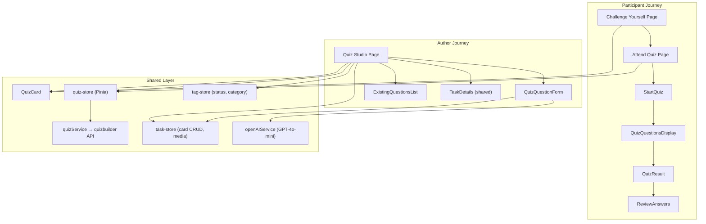
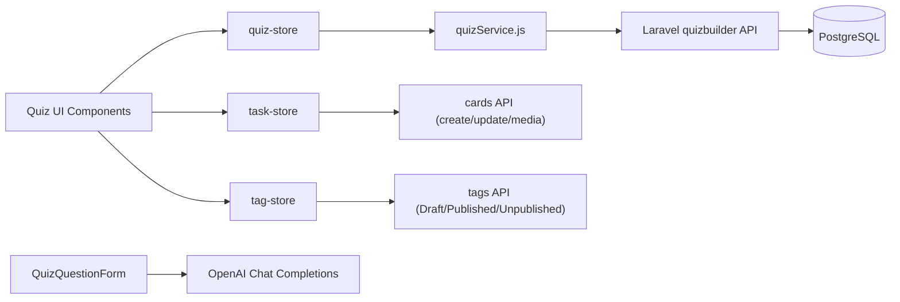
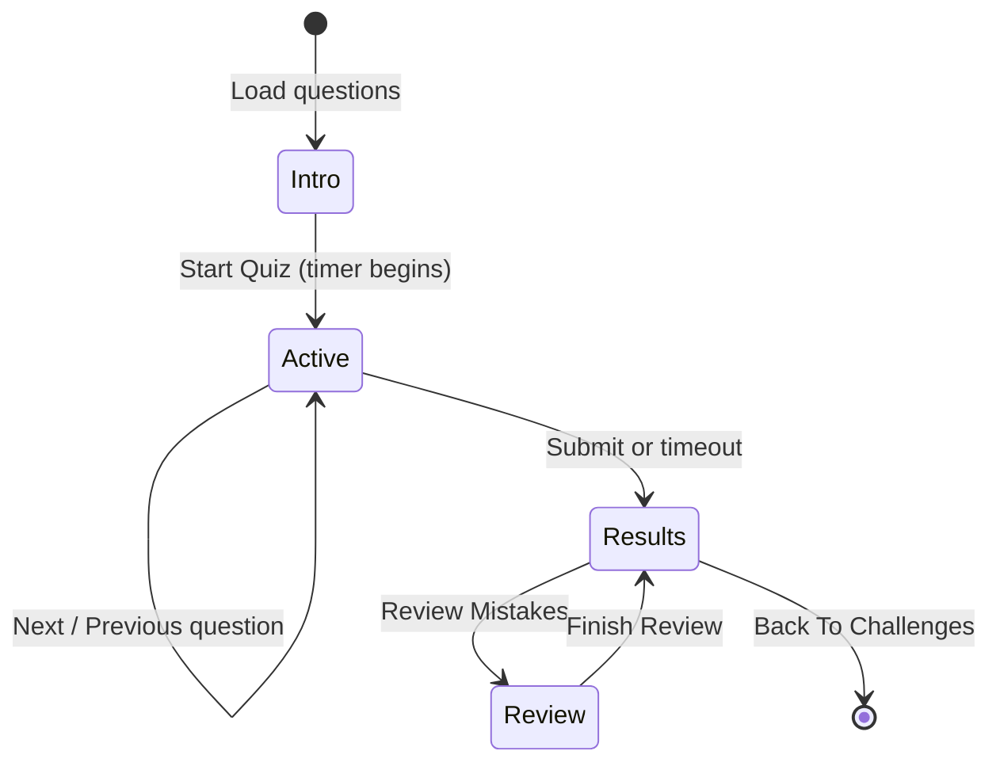

## Executive Summary

The **SuperCards Quiz** module is an internal learning and assessment platform embedded inside the broader SuperCards enterprise workspace. Rather than standing up a separate LMS, the module extends the platform's **card-based data model** — every quiz is a task card tagged as a Quiz entity, categorized by section, and governed by a Draft → Published → Unpublished lifecycle.

I **fully refactored** this module from a tangled set of pages into a clean, modular architecture:

- **4 route-level pages** orchestrating distinct user journeys
- **11 dedicated components** each owning a single UI concern
- **1 Pinia store** (`quiz-store`) with typed API actions
- **1 service layer** (`quizService.js`) against the `quizbuilder` backend

The refactor preserved deep integration with platform primitives (`TaskDetails`, `PreviewWindow`, tag store, media manager) while isolating all quiz-specific logic inside `src/modules/quiz/`.

---

## Architecture

### Module Structure

```
src/modules/quiz/
├── routes.js                    # 4 authenticated routes under /quiz
├── index.js
├── pages/
│   ├── QuizIndex.vue            # Quick quiz creation entry
│   ├── QuizStudioIndex.vue      # Author workspace (full CRUD)
│   ├── ChallengeYourselfIndex.vue  # Employee discovery & browse
│   └── AttendQuiz.vue           # Timed participation flow
└── components/
    ├── QuizCard.vue             # Dual-mode card (studio / challenge)
    ├── QuizQuestionForm.vue     # Authoring, validation, AI generation
    ├── ExistingQuestionsList.vue # Collapsible edit/delete for saved Qs
    ├── QuizQuestionsDisplay.vue # Live question UI during quiz
    ├── StartQuiz.vue            # Pre-quiz intro screen
    ├── QuizResult.vue           # Score summary & grade badge
    ├── ReviewAnswers.vue        # Post-submission mistake walkthrough
    └── QuizParticipants.vue     # Participant analytics popover
```

### System Topology



### Client-to-Cloud Flow



---

## User Journeys

### 1. Quiz Creation (`/quiz/quizzes`)

A lightweight entry point where authors create a new quiz card via the platform's shared creation dialog. On submit, the system tags the card as a **Quiz** entity type with category and difficulty settings.

![Create New Quiz Dialog [desktop]](/images/projects/quiz/create-quiz-dialog.png#desktop)

---

### 2. Challenge Yourself — Assessment Discovery (`/quiz/challenge-yourself`)

The employee-facing catalog of available assessments. Employees can browse published quizzes by category tabs, search by title, and inspect score distributions.

![SuperCards Quiz Challenge Yourself Catalog [desktop]](/images/projects/quiz/challenge-cards-grid.png#desktop)

---

### 3. Attend Quiz — Timed Participation (`/quiz/attend-quiz/:id`)

A structured assessment experience with clear pre-quiz instructions, countdown timers, progress bars, and instant submission.

![Quiz Instructions & Pre-Test View [desktop]](/images/projects/quiz/attend-quiz-intro.png#desktop)

![Active Timed Assessment with Progress & MCQ Questions [desktop]](/images/projects/quiz/attend-quiz-active.png#desktop)



| Phase | Component | Behavior |
|-------|-----------|----------|
| 1 — Intro | `StartQuiz` | Shows question count, time limit, instructions |
| 2 — Active | `QuizQuestionsDisplay` | Progress bar, countdown timer, MCQ radio/checkbox or fill-blank inputs, prev/next navigation |
| 3 — Results | `QuizResult` | Percentage score, grade badge (Excellent / Average / Below Average), correct/incorrect breakdown |
| 4 — Review | `ReviewAnswers` | Walk through each question showing user answer vs correct answer with color-coded feedback |

**Timer logic:** Countdown from quiz meta `time` (minutes); auto-submits and advances to results on expiry.

**Submission:** Normalizes MCQ answers as ID arrays and fill-blank answers as trimmed string arrays before posting to `quizbuilder/startQuiz`.

---

### 6. Quiz Card — Dual-Mode Component (`QuizCard`)

A single reusable card component serving both author and participant contexts via a `mode` prop:

| Feature | `mode="studio"` | `mode="challenge"` |
|---------|-----------------|-------------------|
| **Primary Action** | Preview (opens studio panel) | Take Quiz / Retake Quiz |
| **Status Badge** | Clickable (toggle Published/Unpublished) | Read-only |
| **Score Badge** | Hidden | Shows "My Score: X%" |
| **Analytics** | Participant count (opens menu) | Average score display |
| **Score Distribution** | Above 80% / 60–80% / Below 60% | Same |

**Participant popover:** Clicking participant count opens `QuizParticipants` — searchable, sortable list with top score, average, and attempt count per user.

---

## Data Model

Quizzes are not a separate database entity. They are **SuperCards task cards** enriched with:

| Layer | Field / Tag | Purpose |
|-------|-------------|---------|
| Entity Tag | `Quiz` (Entity Type category) | Identifies card as a quiz |
| Status Tag | `Draft` / `Published` / `Unpublished` | Lifecycle control |
| Category Tag | Quiz Category tags | Section grouping (e.g. HR, Engineering) |
| Meta | `time` | Quiz duration in minutes |
| Meta | `quiz_instructions` | Rich HTML instructions shown before start |
| Media | `quiz_cover_attachment` | Card cover image |
| Media | `quiz_question_attachment` | Per-question images |
| API | `quiz_details` | Aggregated stats (total questions, participants, score breakdown) |

Questions live in the `quizbuilder` service as separate records linked by `quiz_card_id`.

---

## API Surface (`quizService.js`)

| Method | Endpoint Pattern | Used For |
|--------|------------------|----------|
| `getAllQuiz` | `quizbuilder/quizList` | Card grid lists (with `quizCardList` view header) |
| `create` | `quizbuilder/quiz` | Batch question creation |
| `getQuestionsByQuizId` | `quizbuilder/quiz/answers?quizId=` | Load questions for studio + attend |
| `updateQuestion` | `PATCH quizbuilder/quiz/:id` | Edit existing question |
| `deleteQuestion` | `DELETE quizbuilder/quiz/:id` | Remove question |
| `submitAnswers` | `POST quizbuilder/startQuiz` | Participant submission |
| `getParticipants` | `quizbuilder/participantHistory/:quizId` | Participant analytics |

---

## Refactor Summary — What Changed

### Structural
- Extracted **11 components** from monolithic page logic
- Introduced dedicated **`quiz-store`** with 8 typed actions (create, fetch, update, delete, submit, participants)
- Centralized HTTP in **`quizService.js`** with consistent `quizbuilder` resource naming
- Each page is a **thin orchestrator** — route params, store calls, event wiring only

### UX
- **Studio preview panel** replaces full-page navigation for editing
- **Deep link** support (`?card_id=`) for sharing quiz edit URLs
- **Scroll-into-view** with highlight when selecting a card
- **Collapsible existing questions** with search and expand-all
- **Four-phase attend flow** with timer, progress, and mistake review
- **AI question generation** with preview-before-apply workflow

### Technical
- Validation moved to **reactive computed error getters** (not inline template checks)
- Question type switching **resets form state** via watchers (MCQ ↔ fill-blank)
- Answer type switching **normalizes correctAnswers** (single radio ↔ multi checkbox)
- Submission payload **type-normalizes** MCQ IDs and fill-blank strings
- `ReviewAnswers` handles **multiple API response shapes** via candidate field normalization
