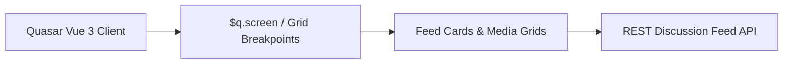

## Executive Summary

The **BRAC Social Platform** is an internal team collaboration portal designed to connect team members through announcements, discussion threads, and peer interactions. My work on this project was focused on **frontend UI fixes and responsiveness** — polishing the user experience, correcting layout anomalies, and making the application feel smooth and usable on all device sizes.

Built with **Vue 3** and the **Quasar Framework**, I tackled real-world UI pain points to deliver a cohesive product feel without adding unnecessary complexity.

---

## Core Responsibilities & What I Delivered

### 1. Cross-Device Responsive Layouts
- Rebuilt rigid desktop-first layout sections with fluid Quasar grid utilities (`row`, `col-xs-12`, `col-sm-6`, `col-md-4`).
- Adjusted header navigation, side drawers, and user avatars to adapt dynamically between desktop monitors, tablets, and smartphones.
- Resolved viewport-overflow bugs and eliminated unintended horizontal page bouncing on touch devices.

### 2. Feed Cards & Media Optimization
- Standardized the visual structure of social feed cards: author headers, timestamp formatting, rich text bodies, and multi-image attachment previews.
- Implemented responsive image grid containers preventing high-resolution photos from breaking container boundaries.
- Refined comment threads and reply inputs for improved tap target accessibility on mobile browsers.

### 3. Interaction & Visual Polish
- Fixed alignment, typography hierarchy, and spacing across announcements and notification drawers.
- Cleaned up active states and micro-interactions for likes, shares, and reaction badges.
