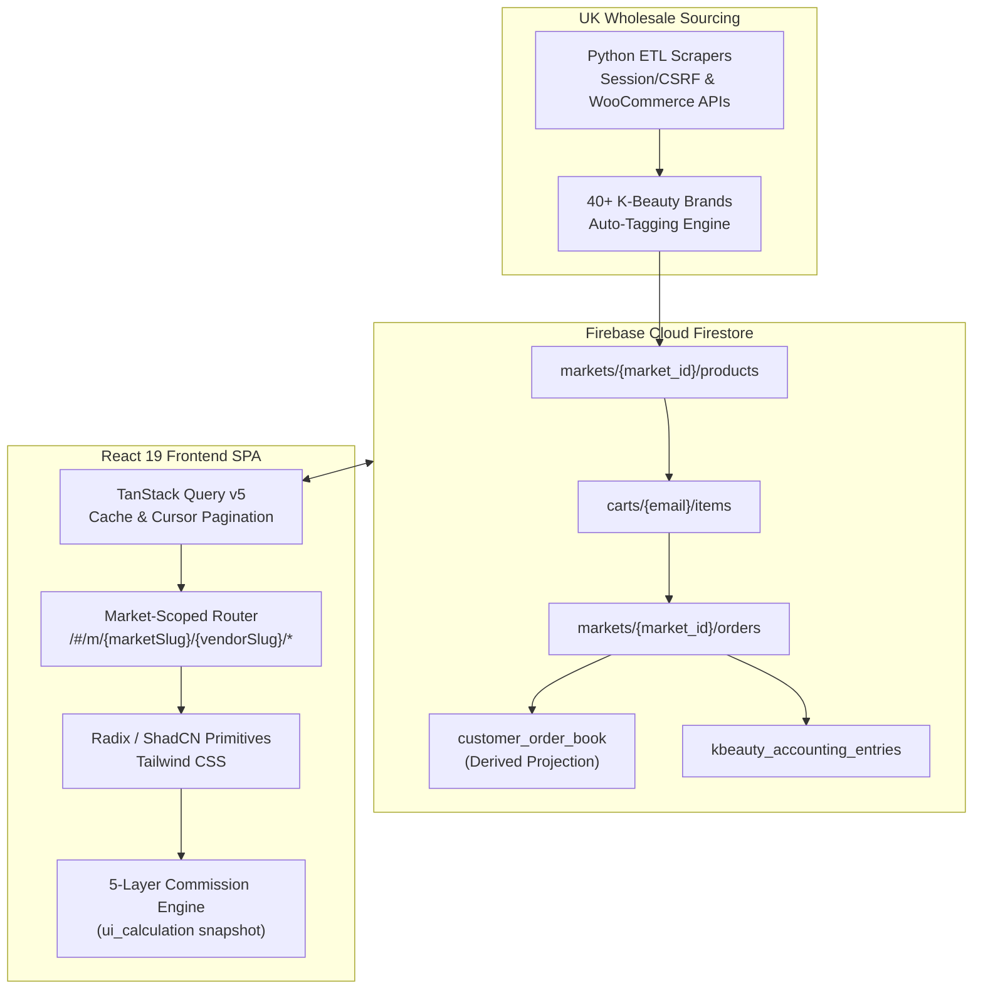
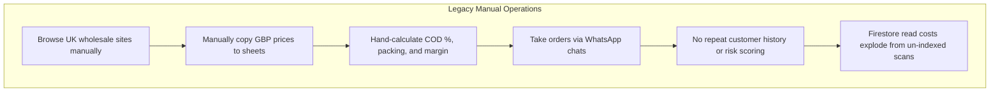
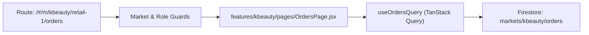
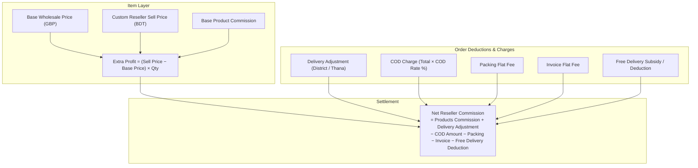
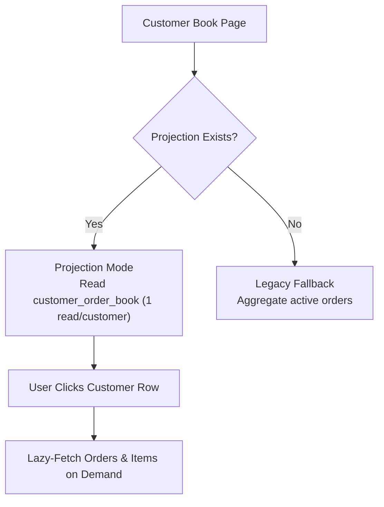

## Executive Summary

**BrandWala Retail (BW Retail)** is a production-grade, market-aware cross-border commerce platform designed for cross-border consumer goods verticals — with its flagship deployment powering the **K-Beauty (Korean Beauty)** retail market.

The platform bridges international wholesale suppliers in the United Kingdom (**Kobareseller**, **Koba International**) with local resellers, retailers, and direct consumers in Bangladesh. Engineered with **React 19**, **Vite 7**, **Tailwind CSS**, **TanStack React Query**, and **Firebase Firestore Lite**, BW Retail automates the complete lifecycle: automated catalog scraping, market-scoped routing, dynamic 5-layer commission accounting, and quota-optimized customer intelligence.

---

## The Cross-Border Problem

Operating cross-border commerce between the UK and Bangladesh creates unique architectural and operational challenges:

| Operational Challenge | Architectural Solution in BW Retail |
|---|---|
| **Stale Sourcing Prices** | Automated Python ETL ingestion pipelines fetching from session-authenticated supplier portals and WooCommerce APIs. |
| **Multi-Tier Profit Sharing** | Deterministic 5-layer commission calculation engine snapshotting pricing, COD fees, and delivery charges on every order. |
| **Firestore Read Quota Spikes** | Debounced search (250ms), cursor pagination, chunked status queries, and derived Customer Order Book projections. |
| **Multi-Market Expansion** | Modular domain architecture separating global auth/users from market features (`web/src/features/kbeauty`). |
| **Database Scalability** | Prepared PostgreSQL relational schema, indexed views, and migration scripts for seamless Firestore-to-SQL cutover. |

---

## Technical Architecture

### 1. Market-Aware & Vendor-Scoped Routing
The application enforces strict URL hierarchy and domain isolation using React Router:
- **Products Catalog**: `/#/m/{marketSlug}/{vendorSlug}/products`
- **Shopping Cart**: `/#/m/{marketSlug}/{vendorSlug}/cart`
- **Order Management**: `/#/m/{marketSlug}/{vendorSlug}/orders`
- **Customer Purchase Book**: `/#/m/{marketSlug}/{vendorSlug}/customers`

Global services (authentication, session state, market navigation) remain completely decoupled from market domain logic, allowing new retail verticals to plug into the platform without modifying core infrastructure.

---

### 2. The 5-Layer Commission Engine
Every order computes net commissions deterministically through domain calculation pipelines (`orderCommission.js` & `uiCommission.js`), storing an immutable `ui_calculation` map directly on the order document:

---

### 3. Quota Optimization & Derived Projections
To eliminate N+1 query fanout and high read costs on Firebase Firestore, BW Retail implements a comprehensive query optimization suite:

1. **Debounced Query Execution**: 250ms debounce on search bars preventing per-keystroke document reads.
2. **Cursor-Based Pagination**: Paginated document cursors with strict limit bounds.
3. **No-Op Write Guards**: Quantity update handlers compare dirty state before dispatching writes.
4. **Derived Customer Order Book**: A dedicated `customer_order_book` projection collection enabling instant KPI aggregation (effective quantities, order counts, gross spend) with lazy-loaded row expansions.

---

### 4. SQL & PostgreSQL Migration Readiness
To prepare the platform for enterprise relational throughput, a complete PostgreSQL migration architecture was designed:
- **Core Relational Schemas**: `sql/postgres/001_core_schema.sql`
- **Performance Indexes**: `sql/postgres/002_indexes.sql`
- **Customer Order Book SQL Views**: `sql/postgres/003_customer_order_book_view.sql`

---

## Personal Engineering Contributions

- **React 19 Frontend Architecture**: Designed the market-aware component hierarchy, Radix/ShadCN UI design system, and TanStack Query state orchestration.
- **Python Automated Sourcing ETL**: Developed web scrapers with session auth and CSRF management for UK wholesale platforms, implementing automated regex brand detection for 40+ brands.
- **Deterministic Commission Accounting**: Authored the full 5-layer commission calculation engine, ensuring zero discrepancies across order creation, status changes, and quantity saves.
- **Firestore Cost Optimization**: Reduced Firestore read volume by over 60% through debounced search pipelines, cursor pagination, and derived projection collections.
- **SQL Migration Strategy**: Architected PostgreSQL database schemas, indexes, and SQL analytical views for long-term database scalability.
