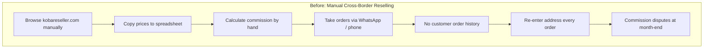
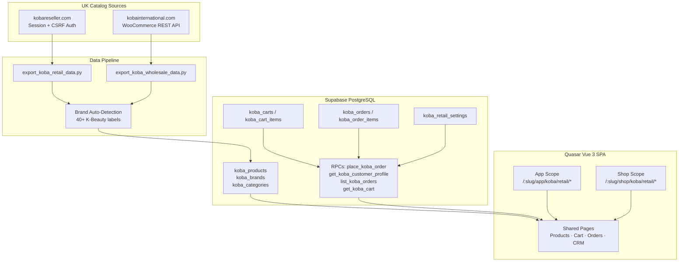
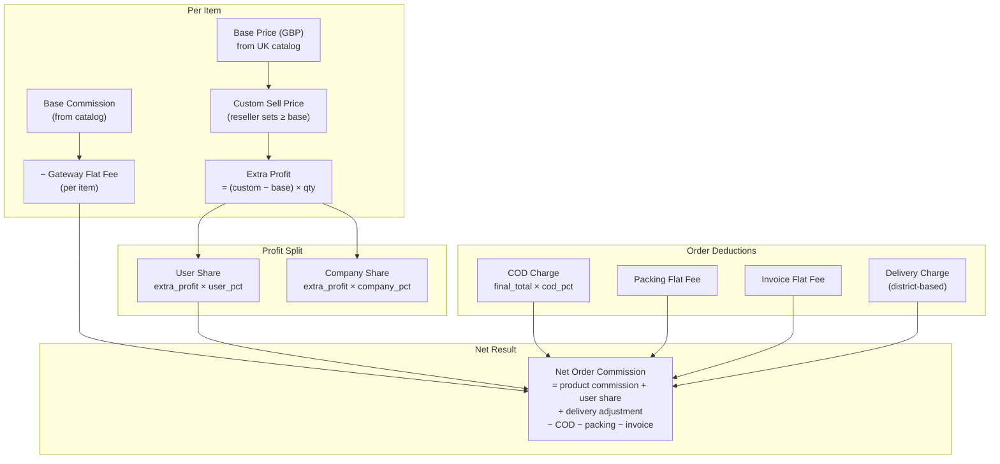
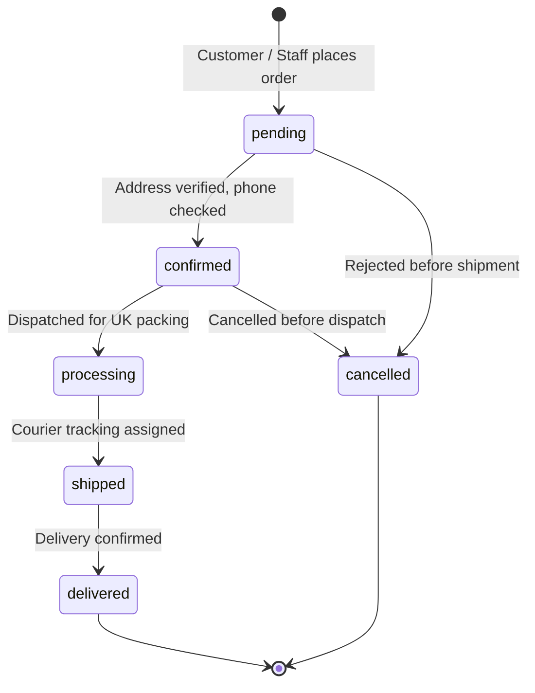
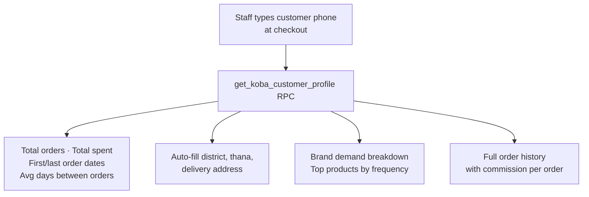

## Executive Summary

**Koba** is a tenant-scoped vertical inside **TradeflowBD** that handles the full cross-border K-Beauty commerce lifecycle — from UK catalog scraping through reseller pricing, cart/checkout, order fulfillment tracking, and customer analytics.

Bangladeshi K-Beauty resellers source authentic products from **UK wholesalers** (Kobareseller, Koba International) at GBP base prices, set custom sell prices in BDT, and distribute them locally via Cash on Delivery (COD). Koba automates catalog ingestion, calculates complex multi-layer commissions, and provides customer intelligence based on phone numbers.

---

## The Problem

K-Beauty resellers in Bangladesh operate a cross-border sourcing model with several manual bottlenecks:

| Pain Point | Business Impact |
|---|---|
| **Manual Catalog Sync** | Prices and stock status stale within days; resellers sell out-of-stock items |
| **Hand-Calculated Commissions** | Errors in COD %, packing fees, and profit splits cause payout disputes |
| **No Customer CRM** | Repeat buyers re-enter addresses; no visibility into delivery success or brand preferences |
| **WhatsApp Order Chaos** | No order status tracking, no confirmed/delivered quantity reconciliation |
| **Separate Staff vs Customer Flows** | Staff desk and customer self-service require duplicate tools |
| **40+ K-Beauty Brands** | COSRX, Laneige, Innisfree, Anua, Beauty of Joseon — manual brand tagging is error-prone |

---

## Architecture

### System Topology & Ingestion Pipeline

### Dual-Scope Routing

One set of Vue pages serves two audiences with scope-aware guards:

| Surface | Route Prefix | Users | Unique Capabilities |
|---|---|---|---|
| **Staff App** | `/:slug/app/koba/retail/*` | Admin, Staff | Custom sell price, commission preview, customer phone lookup, settings, CRM |
| **Customer Shop** | `/:slug/shop/koba/retail/*` | B2B customers | Browse catalog, add to cart, checkout, track own orders |

---

## Commission & Charge Engine

Every order computes net commission through a multi-layer formula configured per tenant in `koba_retail_settings`:

---

## Order Lifecycle & Customer Intelligence

### Customer Graph (Phone-Based CRM)

Repeat buyer profiling keyed on `shipping_phone` — critical for COD risk assessment in Bangladesh:

---

## What I Built (Personal Contributions)

- **Python UK Catalog Scrapers**: Retail (`kobareseller.com`) and wholesale (`kobainternational.com`) pipelines with automated 40+ brand regex tagging.
- **Shared Dual-Scope Commerce Pages**: Single Vue codebase serving both internal staff order desks and customer self-service storefronts.
- **Real-Time Commission & Charge Engine**: Live checkout preview calculating custom markup splits, COD deductions, packaging flats, and net earnings.
- **Atomic Order Placement**: PostgreSQL `place_koba_order` security-definer RPC snapshotting immutable commission states.
- **Phone-Based Customer CRM**: Customer profiling RPC aggregating purchase frequency, brand loyalty, and delivery success rates.
