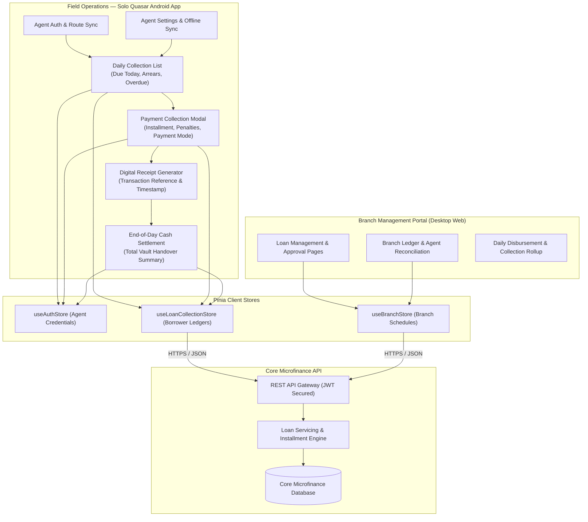
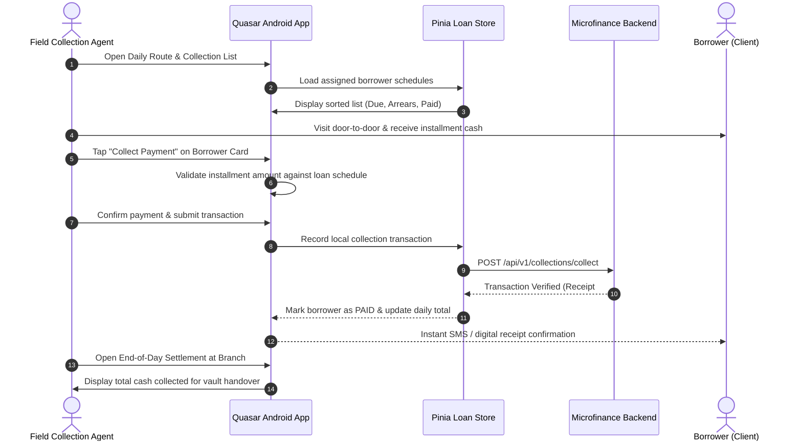

## Executive Summary

The **Microfinance Loan Collection App & Web Portal** is a dual-interface fintech solution engineered to digitize grassroots microfinance operations. Field collection agents conduct door-to-door visits to collect loan installments from borrowers, log payments in real time, view upcoming collection lists, and adjust agent settings. On the web portal, branch supervisors monitor regional loan statuses, branch performance, and agent cash handovers.

As the **solo frontend developer for the Android mobile application** and a **contributor to the branch web management pages**, I built the mobile user experience in **Quasar Framework (Vue 3) + Pinia**, optimizing for rapid touch input, clear route schedules, and reliable daily cash settlements.

---

## Architecture

### Field Collection & Branch Management Topology

---

## Mobile Collection Workflow

The door-to-door collection lifecycle follows an intuitive, high-speed flow designed for field agents moving rapidly between locations:

---

## Visual Workflows & Production Interfaces

### 1. Field Mobile Android App — Route Collection List
![Field Agent Collection Route List [mobile]](/images/projects/microfinance/collections.png#mobile)

### 2. Web Management Portal — Branch Collections Ledger
![Web Portal Branch Collection Ledger [desktop]](/images/projects/microfinance/web-collections.png#desktop)

### 3. Web Management Portal — Member Accounts & Loan Approvals
![Web Portal Member Loan Accounts [desktop]](/images/projects/microfinance/web-members.png#desktop)

---

## Core Technical Decisions

### Decision 1 — Mobile-First Quasar Architecture for Field Hardware

| | |
|---|---|
| **Problem** | Field agents operate on budget Android smartphones in direct sunlight and varying conditions; heavy web views or non-responsive mobile layouts caused slow tapping and frequent UI freezes. |
| **Decision** | Engineered the entire field mobile experience with lightweight Quasar Android components, large touch targets, tactile ripple feedback, high-contrast typography, and Pinia reactive stores. |
| **Outcome** | Lightweight APK footprint with instant screen transitions and zero latency during high-frequency field payment entries. |

---

### Decision 2 — End-of-Day Branch Vault Settlement Reconciliation

| | |
|---|---|
| **Problem** | At the end of every collection shift, branch accountants spent substantial time auditing individual paper receipt slips against cash envelopes handed over by field agents. |
| **Decision** | Built an automated **Day Summary & Settlement** engine that aggregates collected cash by route, borrower count, payment method, and exact timestamps with an immutable sign-off summary. |
| **Outcome** | Eliminated evening settlement bottlenecks and ensured 100% audit parity between field cash collection and core branch accounting ledgers. |

---

## What I Built (Personal Contributions)

- **Solo Mobile App Development**: Built the complete standalone Quasar Android application for field collection agents from scratch.
- **Route & Collection Lists**: Engineered the daily collection scheduler, categorizing borrower cards by `Due Today`, `Arrears`, and `Completed`.
- **Payment Collection & Receipt Flow**: Developed modal payment collection workflows with cash/MFS options and instant receipt generation.
- **Agent Day Settlement & Summary**: Implemented the end-of-day reconciliation view calculating total collections for branch vault handovers.
- **Web Portal Loan UI**: Contributed responsive UI layouts for branch loan management, borrower profiles, and ledger inspection pages.
- **State Management & Caching**: Configured Pinia stores for local collection caching and smooth navigation across field shifts.
