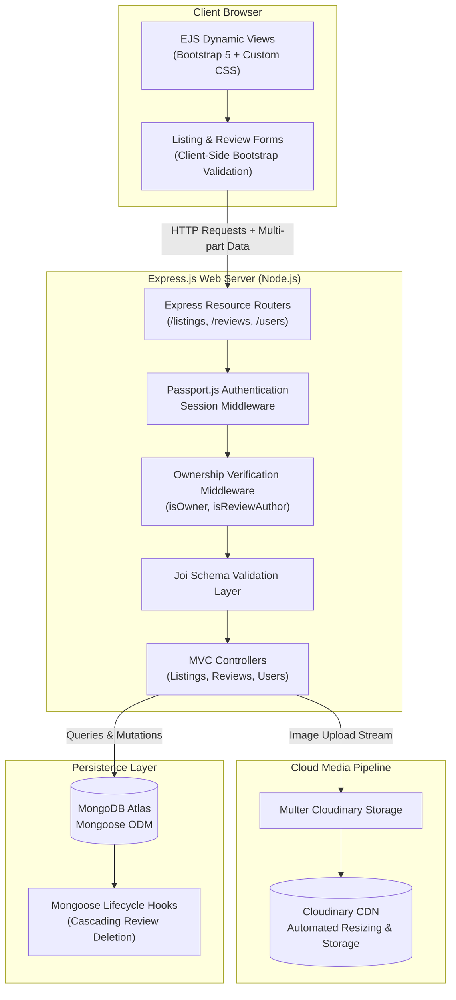
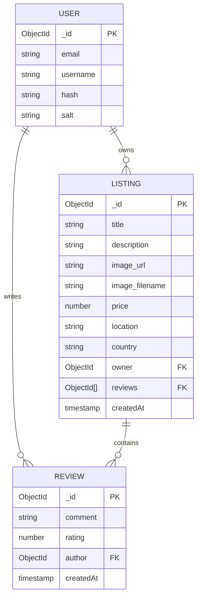
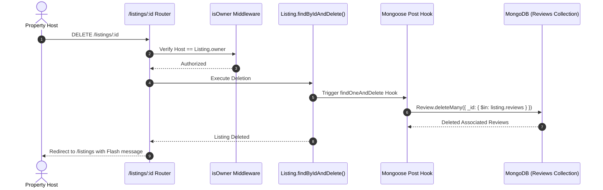
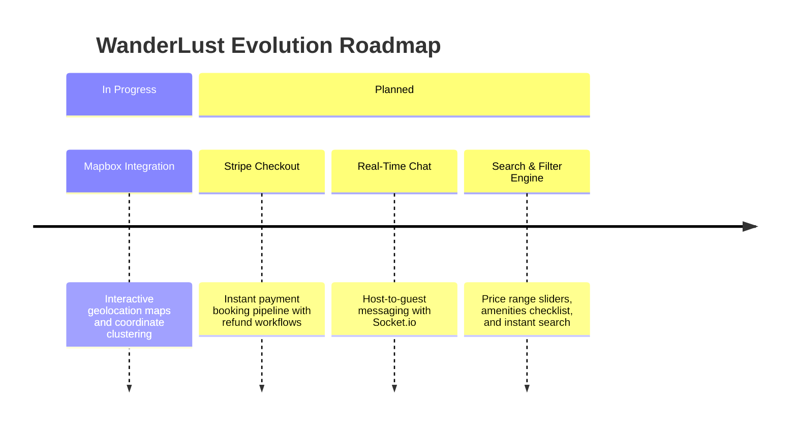

## Executive Summary

**WanderLust** is a full-stack vacation rental marketplace built with **Node.js, Express.js, MongoDB, and EJS**. Designed as an Airbnb mini clone, the platform provides seamless property exploration, multi-image listing registration, automated Cloudinary media transformations, 5-star guest reviews, and session-based authentication with owner-only access controls.

---

## Architecture

### High-level system design



---

## Data Schema & Relationships

WanderLust uses a relational document model inside MongoDB managed through Mongoose schemas:



---

## Core Technical Decisions

### Decision 1 — Server-Side Rendering with EJS & Express MVC

| | |
|---|---|
| **Problem** | Building a lightweight, SEO-friendly marketplace without the overhead and bundle size of a heavy client-side JavaScript SPA framework. |
| **Decision** | Adopted the classic **Model-View-Controller (MVC)** architecture with **EJS layouts** (using `ejs-mate`) and Bootstrap 5 for responsive, server-rendered HTML. |
| **Outcome** | Fast initial page load times, zero client build step required for views, and instant HTML delivery for search engine crawlers. |

---

### Decision 2 — Mongoose Cascading Deletes Middleware

| | |
|---|---|
| **Problem** | When a host deletes a property listing, associated reviews remain orphaned in the MongoDB database, wasting storage and creating data inconsistencies. |
| **Decision** | Implemented a Mongoose post-hook on `findOneAndDelete`: when a listing document is deleted, all review IDs in `listing.reviews` are automatically purged via `Review.deleteMany({ _id: { $in: doc.reviews } })`. |
| **Outcome** | 100% referential integrity with automatic cleanup of associated review documents. |



---

## Visual Workflows & Architecture Wireframes {#visual-workflows}

### 1. Property Details & Review Experience Wireframe

```
+----------------------------------------------------------------------------------------------------+
|  [Logo] WanderLust             |  [Explore]  |  [Add New Listing]          |  [Log In]  |  [Sign Up]|
+----------------------------------------------------------------------------------------------------+
|                                                                                                    |
|  BREADCRUMB: Home > Listings > Cliffside Ocean Villa in Bali                                       |
|                                                                                                    |
|  +-- PROPERTY SHOWCASE --------------------------------------------------------------------------+ |
|  |                                                                                               | |
|  |  +-------------------------------------------------------+  Owned by: @marcelbaroi            | |
|  |  |                                                       |                                    | |
|  |  |                 [ CLOUDINARY HERO IMAGE ]             |  Price: $280 / night               | |
|  |  |             (High-Res Ocean View Villa Photo)         |  Location: Uluwatu, Bali, Indonesia| |
|  |  |                                                       |                                    | |
|  |  +-------------------------------------------------------+                                    | |
|  |                                                                                               | |
|  |  Description: Luxurious 3-bedroom villa with private infinity pool overlooking the ocean.     | |
|  |                                                                                               | |
|  |  [ Edit Listing ]    [ Delete Listing ]   *(Visible only to property owner)*                  | |
|  +-----------------------------------------------------------------------------------------------+ |
|                                                                                                    |
|  +-- LEAVE A REVIEW -----------------------------------------------------------------------------+ |
|  |                                                                                               | |
|  |  Rating: [*] [*] [*] [*] [*]  (5 Stars)                                                       | |
|  |  Comments: [ Enter your stay experience...                                                  ] | |
|  |  [ Submit Review ]                                                                            | |
|  +-----------------------------------------------------------------------------------------------+ |
|                                                                                                    |
|  +-- ALL GUEST REVIEWS (4.9 / 5.0 Rating) -------------------------------------------------------+ |
|  |  +----------------------------------------+  +----------------------------------------+       | |
|  |  | @sarah_travels    ★★★★★ (5/5)          |  | @david_wanderer  ★★★★★ (5/5)           |       | |
|  |  | "Breathtaking views and super clean!"  |  | "Best stay in Bali, will return!"      |       | |
|  |  | [ Delete Review ] *(Author only)*      |  | [ Delete Review ] *(Author only)*      |       | |
|  |  +----------------------------------------+  +----------------------------------------+       | |
|  +-----------------------------------------------------------------------------------------------+ |
+----------------------------------------------------------------------------------------------------+
```

---

## What I Built (Personal Contributions)

- **Engineered Full-Stack MVC Architecture**: Built complete routing, controllers, and EJS views across `/listings`, `/reviews`, and `/users` routes.
- **Implemented Cloudinary Media Pipeline**: Integrated Multer storage for direct photo uploads, image cropping, and responsive cloud delivery.
- **Developed Authentication & Access Control**: Configured Passport.js local strategy with secure password hashing and authorization middleware (`isOwner`, `isReviewAuthor`).
- **Designed MongoDB Schema & Cascading Deletes**: Created Mongoose models with automated cascading deletion for nested review collections.
- **Implemented Robust Input Validation**: Used Joi schemas on the server side to validate listing prices, strings, and review ratings against malicious payloads.

---

## Future Roadmap


