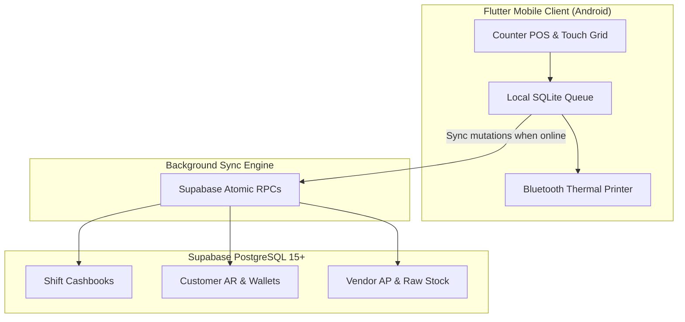

## At a Glance

| Aspect | Implementation Details |
|---|---|
| **Platform** | Native Android APK built with Flutter & Dart |
| **Backend & Cloud** | Supabase Cloud (PostgreSQL 15+, Auth, Realtime, Storage) |
| **Offline Architecture** | Local SQLite write-ahead transaction buffer with automatic conflict resolution |
| **Hardware Integrations** | Bluetooth ESC/POS 58mm/80mm thermal receipt printers, 2D barcode scanner |
| **Core Modules** | Cashier Shifts, Counter POS, Customer Meal AR, Vendor AP, Staff Payroll Logs |

---

## The Operational Challenge

Institutional food services operate differently from standard retail shops. Rather than browsing items, diners want rapid, frictionless service:

1. **Burst Volume:** 80% of daily transactions occur within two concentrated 45-minute periods (breakfast and lunch).
2. **Hybrid Settlement:** Diners pay with cash, digital wallets, or institutional credit accounts (deducted from monthly salaries).
3. **Cashier Accountability:** Canteens operate across multiple shifts with rotating operators; without strict cash drawer float tracking, reconciliation at end-of-day is impossible.
4. **Kitchen Coordination:** Counters need fast item tallying to alert cooks when high-demand dishes (rice, curries, snacks) are running low.

---

## Key Functional Modules

### 1. Shift & Cash Drawer Control
Before processing any transactions, cashiers must open an active business shift by declaring the starting physical cash float. Every incoming cash payment, customer cash-in, and expense payout is tracked against that active shift. At handover, the app calculates expected versus physical cash, logging variances for management review.

### 2. Customer Meal AR & Institutional Accounts
Regular diners, faculty, or corporate employees maintain digital meal accounts with configurable credit ceilings. The system allows post-paid dining with automatic ledger updates, generating end-of-month statements for direct payroll deduction or cash settlement.

### 3. Rapid Counter POS & Hardware Integration
The UI is optimized for large touch targets and minimum taps. Counter staff can add items, select payment method (Cash, Digital Wallet, or Account Credit), and print an itemized kitchen slip in less than two seconds.
